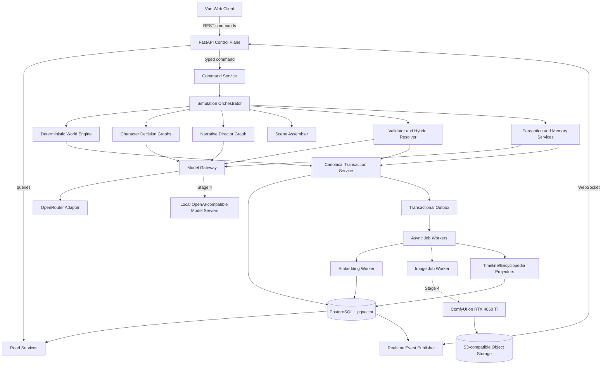
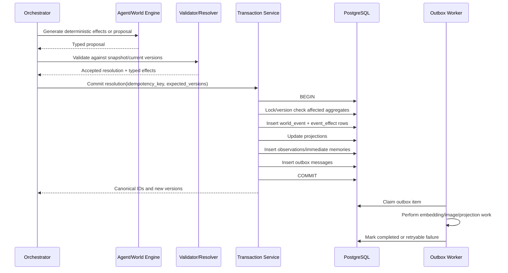

# System Architecture

**Version:** 1.0  
**Status:** Normative component and boundary design  
**Scope:** Stage 0 single-process foundation through Stage 5 distributed local operation

---

## 1. Architectural objective

The architecture must allow creative model behaviour without allowing probabilistic output to become an uncontrolled database mutation. It must also support long-running state, perspective isolation, deterministic rules, asynchronous work, provider migration, and multi-session development.

The system is organized around a strict split:

```text
Creative proposal plane
  Character agents, Director, narrator, memory summarizer, image composer

Deterministic authority plane
  World Engine, validation, resolver rules, transaction services, projections

Persistence plane
  PostgreSQL, pgvector, event log, task/outbox state, object storage

Presentation plane
  FastAPI, WebSocket events, Vue client, timeline, map, encyclopedia, gallery

Execution plane
  In-process workers initially; later Temporal workers, Halo model servers,
  and an RTX ComfyUI worker
```

---

## 2. Top-level architecture



---

## 3. Component catalog

### 3.1 FastAPI Control Plane

Responsibilities:

- expose read APIs and typed commands;
- enforce user-role permissions;
- accept idempotency keys;
- start, pause, step, and inspect simulation;
- expose health and worker status;
- publish realtime event notifications;
- translate domain errors into stable API errors.

Must not:

- contain simulation business rules;
- directly call model providers from request handlers;
- directly mutate ORM entities outside application services;
- expose omniscient data in player-mode endpoints.

### 3.2 Simulation Orchestrator

Responsibilities:

- own the phase state machine;
- enforce phase barriers and dependencies;
- schedule World Engine, director, character, scene, resolution, memory, and outbox work;
- reserve model-request budget before starting work that cannot safely stop halfway;
- recover incomplete task runs;
- record transition state and errors;
- pause at safe boundaries.

Stage 0–3 implementation:

- application service with PostgreSQL-backed `phase_run`, `task_run`, and outbox state;
- one logical leader guarded by advisory lock or lease;
- worker functions may remain in one process.

Stage 4 implementation:

- map phase/day workflows to Temporal workflows and activities;
- preserve the same application service interfaces;
- do not make Temporal workflow history canonical.

### 3.3 Deterministic World Engine

Responsibilities:

- advance phase and absolute phase index;
- apply scheduled effects;
- progress travel and ongoing activities;
- update weather and environmental state;
- update recovery, stamina, mana, needs, and ageing according to rules;
- check interruptions;
- generate deterministic encounter candidates from stored seeds;
- evaluate end conditions;
- produce typed effect commands/events.

The World Engine has no model dependency.

### 3.4 Narrative Director

Responsibilities:

- inspect omniscient canonical summaries and pacing state;
- determine whether a director proposal is warranted;
- propose a bounded event, hook, NPC, location detail, arc transition, or pacing adjustment;
- declare prerequisites, visibility, intended participants, narrative purpose, duration, and permitted effect categories;
- maintain trope and stagnation awareness.

The Director does not commit its own proposal and does not control scene outcomes.

### 3.5 Character Decision Graph

Responsibilities:

- receive one perspective-safe context envelope;
- optionally query bounded memory/entity tools through approved application ports;
- return one structured action proposal;
- preserve character voice in optional dialogue;
- avoid writing other characters’ hidden state.

One reusable graph serves all characters. Character identity is data, not code or hardware assignment.

### 3.6 Scene Assembler

Responsibilities:

- group action proposals by explicit targets, location, time overlap, shared resources, route conflict, appointment, event, or causal dependency;
- detect independent scenes safe for parallel resolution;
- merge conflicts involving the same mutable aggregate;
- assign participant roles and beat budgets;
- compute deterministic priority features;
- request only bounded narrative-salience scoring where necessary.

The assembler is primarily deterministic.

### 3.7 Validator and Hybrid Resolver

Responsibilities:

- validate Pydantic/schema shape;
- validate actor permission, knowledge, capability, resource, location, activity, and target prerequisites;
- determine feasible outcome envelope;
- obtain reactions from eligible participants;
- resolve deterministic cases without a model;
- use a dedicated model role for bounded ambiguity;
- return typed effects and delayed effects;
- validate every effect against current optimistic versions before commit.

The same small logical model may serve semantic validation and resolution through separate profiles. They remain separate stages even when the physical model is shared.

### 3.8 Canonical Transaction Service

Responsibilities:

- open the scene/event transaction;
- lock or version-check affected aggregates;
- allocate event sequence number;
- insert world event and accepted effects;
- update projections;
- create observations and immediate memories where part of the atomic contract;
- create outbox records;
- commit once;
- return canonical event IDs and versions.

Remote calls are forbidden inside this transaction.

### 3.9 Perception Service

Responsibilities:

- calculate eligible observers;
- apply line-of-sight, hearing, magical-sense, participation, communication, and concealment rules;
- create allowed fact sets per observer;
- optionally use a model to phrase an observation within the allowed fact set;
- detect and reject observation text that introduces forbidden facts.

### 3.10 Context Assembler

Responsibilities:

- enforce role and character scope;
- read stable card, dynamic state, perceptions, goals, plans, relationships, recent memory, long-term retrieval, and local lore;
- apply token budgets and ordering;
- delimit untrusted memory/lore text;
- attach source IDs and hashes;
- produce a reproducible context manifest for each model call.

No agent receives arbitrary repository access. All perspective-sensitive data flows through this component or an equally restrictive port.

### 3.11 Memory Services

Responsibilities:

- create immediate episodic memory candidates;
- calculate salience;
- maintain recent buffers;
- consolidate daily and monthly summaries;
- extract beliefs, commitments, relationship evidence, and unresolved questions;
- enqueue embeddings;
- retrieve long-term memories with strict metadata filters;
- maintain embedding versions and rebuilds.

### 3.12 Model Gateway

Responsibilities:

- expose provider-independent text and embedding ports;
- resolve logical model roles to versioned profiles;
- capability-probe providers;
- apply context/output budgets and sampling;
- enforce structured-output mode where supported;
- record request/response metadata and token/quota use;
- implement timeout, retry, backoff, and fallback policy;
- reject sending prohibited data to remote providers;
- support OpenRouter initially and local OpenAI-compatible servers later.

### 3.13 Async Job Workers

Jobs include:

- memory embedding;
- daily/monthly consolidation when not phase-critical;
- image generation;
- image quality checks;
- encyclopedia and timeline projection;
- evaluation runs;
- backup/maintenance tasks.

Workers claim jobs with leases, use idempotency keys, heartbeat when long-running, and write status/results transactionally.

### 3.14 Presentation Projectors

Responsibilities:

- create efficient read models for timeline, diary, encyclopedia, character overview, map, and gallery;
- retain perspective variants where required;
- rebuild from canonical events and source tables;
- never feed presentation prose back as factual authority.

### 3.15 Vue Client

Responsibilities:

- role-aware navigation and data filtering;
- timeline and visual-novel scene display;
- character, map, encyclopedia, diary, gallery, and operations views;
- typed command submission with idempotency keys;
- WebSocket updates and reconnect;
- explicit confirmation for destructive deity/retcon commands;
- accessibility and reduced-motion support.

---

## 4. Layered code architecture

```text
worldsim.domain
  Pure types, value objects, enums, invariants, deterministic rules.
  Imports: Python standard library and tightly controlled validation primitives.

worldsim.application
  Use cases, orchestration, ports, transaction scripts, context assembly.
  Imports: domain and abstract ports.

worldsim.agents
  LangGraph definitions, prompt rendering, model-facing adapters to application ports.
  Imports: domain contracts, application ports, LangGraph.

worldsim.infrastructure
  SQLAlchemy, PostgreSQL, OpenRouter, local model clients, ComfyUI, object storage,
  Temporal adapters, logging/metrics exporters.
  Imports: domain and application interfaces.

worldsim.interfaces
  FastAPI routes, WebSocket publisher, CLI/debug commands, serialization DTOs.
  Imports: application services and boundary contracts.
```

Dependency direction:

```text
interfaces ───────┐
agents ───────────┼──> application ───> domain
infrastructure ───┘
```

The domain never imports FastAPI, SQLAlchemy, LangGraph, OpenRouter, Temporal, or ComfyUI.

---

## 5. Canonical write path



No generated narration appears before the structured outcome exists. The UI may display a temporary “scene resolving” state but not an uncommitted result as fact.

---

## 6. Read paths and perspective

### Omniscient read

Used by Watcher, Director, resolver, audits, and administrative tools. Reads canonical state and private data according to explicit service permissions.

### Character/player read

Uses `PerspectiveQueryService(observer_id, as_of_phase_id)` and returns:

- current perceived surroundings;
- discovered map;
- known entities;
- personal relationships;
- beliefs and memories;
- own state and inventory;
- public information;
- no hidden director or other-character data.

### Presentation read

Uses precomputed or query-composed read models. The frontend never performs ad hoc joins that could bypass perspective rules.

---

## 7. Trust boundaries

```text
Trusted deterministic core
  Domain rules, transaction service, DB constraints, permission service.

Conditionally trusted application code
  Context assembler, repositories, orchestrator, API service.

Untrusted generated data
  All LLM output, embeddings metadata, narration, image prompts, images,
  memory/lore text, user-authored free text, imported seed content.

External services
  OpenRouter, later local model servers, ComfyUI, optional object storage.
```

All untrusted data is parsed, size-limited, schema-validated, permission-checked, and kept out of executable SQL/shell/path contexts.

---

## 8. Stage-by-stage deployment evolution

### Stage 0

```text
One Python process
PostgreSQL + pgvector container
Fake model adapter + live OpenRouter smoke command
No frontend required
No Temporal
No ComfyUI
```

### Stage 1

```text
FastAPI and simulation worker may share one process
PostgreSQL container
OpenRouter text calls
Three enabled phases
Simple local Vue shell optional but recommended near stage end
```

### Stage 2

```text
FastAPI process
Simulation/background worker process
PostgreSQL
Vue client
OpenRouter text calls; optional shadow embedding jobs that do not affect decisions
Database-backed task/outbox queues
```

### Stage 3

```text
API, simulation worker, and maintenance worker separated
PostgreSQL + pgvector
Full Vue client
OpenRouter text/embedding
Optional observability stack
Thirty-day soak harness
```

### Stage 4

```text
Control-plane machine:
  FastAPI, PostgreSQL, object storage, orchestration service, WebSocket

Halo A:
  OpenAI-compatible local text server replica

Halo B:
  OpenAI-compatible local text server replica and optional embedding service

RTX 4060 Ti machine:
  ComfyUI image worker and optional vision-quality model

Temporal:
  self-hosted durable workflow adapter if promotion criteria are met
```

The control plane should run on the machine with the highest availability, not whichever system currently hosts a character model.

### Stage 5

Adds macro-simulation workers, genealogy projections, era summaries, and generation-transition workflows. The physical topology need not change.

---

## 9. Availability and failure domains

| Failure | Required behaviour |
|---|---|
| OpenRouter 429 or daily quota exhausted | Honour retry metadata; do not begin unsafe work; use deterministic fallback or pause at boundary. |
| Text model malformed output | Local repair, one bounded regeneration, fallback or task failure. |
| Embedding outage | Keep relational memories; enqueue later; do not block immediate next phase unless retrieval is mandatory by stage policy. |
| Database unavailable | Do not acknowledge commands or tasks; retry connection; no in-memory canonical writes. |
| Process crash before commit | Retry from durable task state; no event exists. |
| Process crash after commit before acknowledgement | Idempotency lookup returns existing result. |
| Worker dies with claimed job | Lease expires; another worker reclaims. |
| Halo model worker dies | Gateway routes retry to compatible worker; identity remains unchanged. |
| ComfyUI offline | Image jobs remain queued; text simulation continues. |
| Object storage offline | Image output finalization retries; event remains canonical. |
| WebSocket disconnect | Client reconnects and resumes from event cursor. |
| Hard retcon creates inconsistency | Mark downstream projections tainted; run audit; display warning. |

---

## 10. Concurrency model

- World/phase advancement has one logical leader per world.
- Primary character model calls may run concurrently after snapshot sealing.
- Independent scenes may resolve concurrently only when their mutable aggregate sets are disjoint.
- Shared characters, locations with capacity constraints, unique items, activities, and global resources create conflicts.
- Canonical commits use optimistic versions and short transactions.
- Async jobs are at-least-once delivery with idempotent consumers.
- WebSocket events may be duplicated or reordered across reconnect; clients use sequence cursors.

---

## 11. Data ownership matrix

| Data | Owner | Writers | Readers |
|---|---|---|---|
| World clock | World Engine aggregate | World Engine transaction | All read services |
| Character card | Character-card service | Seed/admin/evolution event | Context/UI/director |
| Character state | Character aggregate | Validated effects | Context/UI/resolver |
| Event history | Canonical transaction service | Transaction service only | Audits, projections, memory |
| Observation | Perception service in commit flow | Transaction service | Character context, diary |
| Belief | Belief update service | Validated evidence/compaction | Character context/UI |
| Memory | Memory service | Observation/compaction | Owner-scoped retrieval |
| Model call | Model gateway | Gateway only | Debug/metrics/audit |
| Prompt version | Prompt registry | Developer/admin deployment | Gateway/reproduction |
| Image asset | Image pipeline | Image worker | UI/gallery |
| Task state | Orchestrator/job service | Workers/orchestrator | Operations UI |

---

## 12. Design patterns used intentionally

- **Ports and adapters:** replace OpenRouter/local models, PostgreSQL repositories, ComfyUI, and Temporal without contaminating domain logic.
- **State machines:** phase, scene, task, image, and activity lifecycles are explicit.
- **Transactional outbox:** canonical commit and asynchronous intent are durable together.
- **Optimistic concurrency:** detect stale scene resolutions without long-held locks.
- **CQRS-lite:** canonical write model plus purpose-built read projections, without separate databases.
- **Append-only audit:** events, observations, model calls, and user overrides are retained.
- **Schema versioning:** Pydantic, prompts, model profiles, embeddings, visual state, and APIs have versions.
- **Bulkheads:** image, embedding, narration, and model failures do not all share one queue or retry budget.

Patterns explicitly avoided initially:

- one autonomous agent per citizen;
- generic EAV database;
- pure event sourcing for all reads;
- actor framework bound to character identity;
- giant global LangGraph thread;
- direct model-to-database tools;
- distributed microservices before the single-process vertical slice works.

---

## 13. Architecture fitness functions

CI and scenario tests should continuously prove:

1. Domain imports no infrastructure modules.
2. A model response cannot call a repository write method.
3. All state mutation functions require an effect/resolution and idempotency context.
4. Two character contexts from the same phase reference one snapshot and contain no cross-private memory IDs.
5. A duplicate commit request returns the original event.
6. Image failure does not change phase status.
7. All current-state rows changed by a scene reference the committed event or version.
8. The API cannot access omniscient read services through a player-scoped route.
9. Remote model calls occur with no active database transaction.
10. The model gateway can swap between a fake adapter and OpenRouter without changing application code.

---

## 14. Architecture review checklist

Before accepting a new subsystem or dependency, answer:

- Which layer owns it?
- What canonical data can it read or write?
- What is its idempotency strategy?
- What happens on timeout and duplicate delivery?
- Does it preserve perspective boundaries?
- Is its state reconstructable?
- Does it introduce a new source of truth?
- Can it be tested without live models?
- Can it be replaced without changing domain rules?
- Which stage requires it now?

If the answer to “which stage requires it now?” is none, defer it unless it removes immediate risk.
