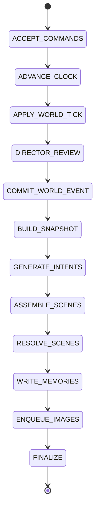
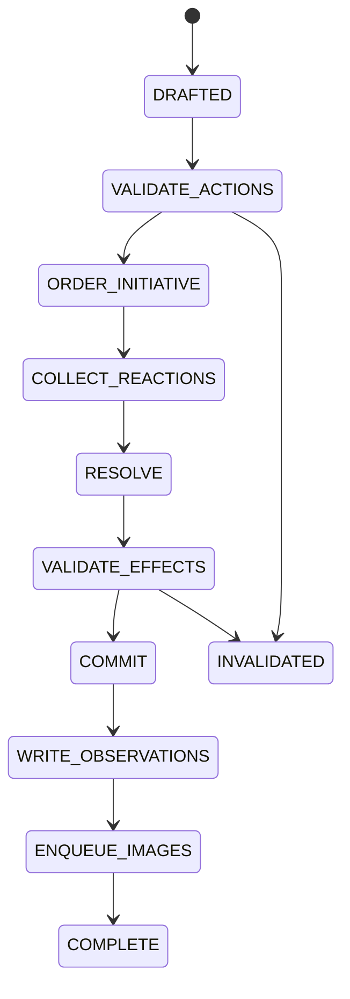

# Autonomous Fictional World
## Domain Contracts and Simulation State Machines

**Version:** 1.0  
**Date:** 2026-07-29  
**Status:** Normative domain contract  
**Scope:** Stages 0–3: foundation through autonomous-month prototype  
**Primary implementation language:** Python 3.12+  
**Validation layer:** Pydantic v2  
**Canonical persistence target:** PostgreSQL + pgvector  
**Agent workflow target:** LangGraph inside a deterministic simulation orchestrator

**Revision note:** This 1.0 edition preserves the validated Pydantic contracts from the earlier draft, aligns stage names with the full handbook, treats OpenRouter capabilities as runtime-probed, and clarifies that the outer orchestrator—not LangGraph checkpoint state—owns phase progress.

---

## 1. Purpose

This document defines the contracts that keep the fictional world coherent while language models provide creativity.

It is deliberately stricter than a prompt design. It defines:

- the vocabulary used by the codebase;
- which objects are authoritative;
- what models may propose;
- what only deterministic application code may commit;
- the exact phase and scene lifecycles;
- retry, pause, failure, and idempotency behaviour;
- the initial OpenRouter model configuration;
- the minimum schemas needed for the first vertical slice.

The central rule is:

> **Models may propose intentions, dialogue, interpretations, events, and typed effects. Only validated effect commands committed inside a database transaction may change the world.**

---

## 2. Scope and non-goals

### 2.1 In scope

The first implementation covered by this contract supports:

- one canonical world;
- one active timeline;
- two main characters initially;
- expansion to two main and two sub-main characters;
- a configurable subset of the ten canonical day phases during early testing;
- an always-first deterministic World Engine tick;
- an optional Narrative Director proposal;
- simultaneous character intent generation from one immutable phase snapshot;
- scene assembly, bounded reactions, resolution, and atomic commits;
- character-specific observations, claims, beliefs, and memories;
- durable image-job enqueueing without blocking simulation progress;
- OpenRouter-hosted text generation and embeddings during early stages.

### 2.2 Explicitly deferred

The following are not required for the first complete-day or seven-day vertical slices:

- full multi-generation simulation;
- autonomous childbirth and succession;
- complex economy simulation;
- fully distributed Temporal deployment;
- local text-model serving;
- image generation itself;
- character-specific text LoRAs;
- automatic promotion of temporary NPCs into focus-character slots;
- exhaustive combat and magic rule coverage;
- deterministic replay across model/provider changes.

The schemas must remain extensible to these features, but the initial implementation must not pretend to solve all of them.

---

## 3. Initial model stack: OpenRouter development profile

### 3.1 Text model

```text
Provider: OpenRouter
Model slug: nvidia/nemotron-3-super-120b-a12b:free
Logical roles:
  - character action proposal
  - narrative director proposal
  - semantic plausibility review
  - ambiguous scene resolution
  - optional scene narration
  - memory consolidation
```

As exposed by OpenRouter on 2026-07-29, the free endpoint has a **262K-token context window**. The underlying model may advertise a larger native context elsewhere, but the application must use the endpoint capability as the operational limit.

The initial application context budget should remain much smaller:

```text
Target input budget per decision: 12K–20K tokens
Hard application maximum:          32K tokens
Typical structured output:         300–1,200 tokens
Typical narration output:          800–2,000 tokens
```

Large advertised context windows are not permission to send an entire character lifetime on every turn.

### 3.2 Embedding model

```text
Provider: OpenRouter
Model slug: nvidia/nemotron-3-embed-1b:free
Native dimensions: 2048
Database column: vector(2048)
Document prefix: "passage: "
Query prefix:    "query: "
Similarity: cosine similarity or normalized dot product
```

The application must use the same embedding model and prefix convention for indexing and querying. Every stored embedding must record its exact model slug, dimension, prefix type, and content hash.

### 3.3 Free-endpoint constraints

OpenRouter currently documents the following free-model platform limits:

| Lifetime OpenRouter credits purchased | Requests/minute | Requests/day |
|---:|---:|---:|
| Less than USD 10 | 20 | 50 |
| At least USD 10 | 20 | 1,000 |

These limits make the free endpoints appropriate for development and low-volume simulation, not the final four-character, ten-phase production loop.

The application must therefore include a real-time request ledger and must never assume that an available model is an unlimited resource.

The free Nemotron text endpoint also displays an explicit warning not to send confidential or personal information and states that usage may be recorded for security and NVIDIA product improvement. During this phase, send only fictional world data and synthetic test fixtures. Do not place credentials, private company information, or real-person data in prompts.

### 3.4 Capability probe

At application startup, the `ModelGateway` must probe or verify:

1. the text model slug is currently available;
2. the embedding model slug is currently available;
3. the text endpoint's reported context length;
4. whether the serving endpoint supports strict JSON Schema output;
5. whether the serving endpoint supports the requested sampling parameters;
6. the returned embedding dimension is exactly `2048`;
7. a one-item embedding and a batch embedding both work;
8. the current free-request allowance can be queried or tracked.

Endpoint capabilities can change independently of the model name. The system must not hard-code structured-output support as permanently available.

### 3.5 Structured-output policy

All state-affecting model calls are **non-streaming** and follow this fallback chain:

```text
1. JSON Schema structured output, with provider capability required.
2. JSON-object mode plus OpenRouter response healing.
3. Plain JSON instruction plus local syntax extraction/repair.
4. Pydantic validation.
5. One regeneration containing only validation errors.
6. Domain-safe fallback or phase pause.
```

Response healing may repair syntax. It is not semantic validation and may not invent missing domain correctness.

### 3.6 Stage-specific call conservation

When the configured OpenRouter key is subject to a low free-request allowance, Stage 1 should use:

- two characters;
- three active phases selected from the ten-phase calendar;
- a deterministic World Engine tick every phase;
- no autonomous Narrative Director calls;
- deterministic resolution for movement, waiting, rest, and other unambiguous actions;
- model-assisted resolution only for genuinely ambiguous scenes;
- template timeline narration by default;
- model-generated prose only for salient scenes;
- no long-term retrieval dependency; optional daily embedding may run only as a shadow experiment.

The deterministic fake-model scenario is the stage gate. A complete live seven-day or thirty-day run may exceed the current free allowance and must be scheduled across real days, use an allowed paid allowance, or wait for local inference. The scheduler always uses runtime capability/quota state rather than assuming the handbook's observed values remain valid.

---

## 4. Authoritative layers

The system has five authority levels, from highest to lowest:

1. **Validated database state and committed events**
2. **Deterministic simulation and domain rules**
3. **Validated resolver output awaiting commit**
4. **Model proposals and generated narration**
5. **Generated images**

A lower level can never override a higher level.

Examples:

- A narration saying a character moved does not move them unless a `MOVE_ENTITY` command committed.
- An image showing a scar does not add the scar to character state.
- A character saying “the king is dead” creates a claim, not a death event.
- A director proposing a war does not start a war until prerequisites and effects are validated and committed.

---

## 5. Ubiquitous language

| Term | Exact meaning |
|---|---|
| **World Engine** | Deterministic code that advances time and applies physical/systemic rules. |
| **Narrative Director** | Omniscient model role that proposes opportunities, events, arcs, NPCs, and pacing changes. |
| **Phase** | One canonical day interval: dawn, sunrise, morning, noon, afternoon, sunset, dusk, evening, night, or midnight. |
| **Phase snapshot** | Immutable view of committed world state from which all primary character intents in that phase are generated. |
| **Perception package** | Character-specific, access-controlled projection of the snapshot and newly visible events. |
| **Intent** | One character's proposed next meaningful action, generated without knowing other characters' same-phase intents. |
| **Attempt** | The validated, externally observable execution of an intent before its result is known. |
| **Reaction** | A bounded response by an eligible participant to an observable attempt. |
| **Scene** | A group of causally interacting intents, attempts, reactions, entities, and one resolution transaction. |
| **Resolution** | A structured proposed outcome containing typed effect commands. |
| **Effect command** | A typed request to change canonical state. It remains non-authoritative until deterministic validation and commit. |
| **World event** | Immutable committed historical record of one canonical occurrence and its accepted effects. |
| **Observation** | What one observer was able to perceive from one event. |
| **Claim** | A proposition communicated by an entity. It may be true, false, misleading, or uncertain. |
| **Belief** | One character's confidence-weighted proposition, based on observations, claims, and interpretation. |
| **Memory** | A perspective-specific retained representation sourced from observations, claims, beliefs, or prior memories. |
| **Activity** | A persistent action spanning multiple phases, such as travel, sleep, training, or crafting. |
| **Hook** | A possible future development that has not yet become the dominant narrative arc. |
| **Arc** | A bounded, persistent narrative-development structure with goals, escalation, and conclusion criteria. |
| **Outbox record** | A database row written in the same transaction as a world event and later published as an asynchronous job. |

---

## 6. Identity, ordering, versioning, and time

### 6.1 Identifiers

All persistent domain entities use UUIDs. Prefer time-sortable UUIDv7 values in the implementation.

Names are never identifiers. A character may change names, use aliases, or share a name with another entity.

### 6.2 Canonical ordering

Every committed world event receives:

```text
world_event.sequence_number
```

This is a monotonically increasing integer within the one world. It defines canonical historical order even when multiple scenes are processed concurrently.

### 6.3 Optimistic versions

Every mutable aggregate has an integer version:

```text
character_state.version
location_state.version
item_state.version
relationship_edge.version
faction_state.version
activity.version
```

A scene commit must compare the versions it validated against with the current versions. A mismatch forces revalidation or scene reassembly; it must never silently overwrite newer state.

### 6.4 Fictional time

The minimum time representation is:

```text
generation_index
world_day_index
phase
absolute_phase_index
calendar_label (optional presentation)
```

`absolute_phase_index` is monotonic and is used for scheduling, decay, ordering, and retrieval filters. The generated world's calendar may later map this to named months and years.

### 6.5 Real time

Infrastructure timestamps use timezone-aware UTC datetimes. Fictional time does not advance while the simulation is paused or offline.

---

## 7. Reference Pydantic domain contracts

The following is the normative schema skeleton for the first implementation. Database models may contain additional operational columns, but they must preserve these semantics.

```python
from __future__ import annotations

from datetime import datetime
from enum import StrEnum
from typing import Annotated, Literal, TypeAlias, Union
from uuid import UUID

from pydantic import BaseModel, ConfigDict, Field


class ContractModel(BaseModel):
    """Strict immutable contract used at service and model boundaries."""

    model_config = ConfigDict(
        extra="forbid",
        frozen=True,
        str_strip_whitespace=True,
        validate_default=True,
    )


# ---------------------------------------------------------------------------
# Shared enums
# ---------------------------------------------------------------------------


class DayPhase(StrEnum):
    DAWN = "dawn"
    SUNRISE = "sunrise"
    MORNING = "morning"
    NOON = "noon"
    AFTERNOON = "afternoon"
    SUNSET = "sunset"
    DUSK = "dusk"
    EVENING = "evening"
    NIGHT = "night"
    MIDNIGHT = "midnight"


class RunStatus(StrEnum):
    PENDING = "pending"
    RUNNING = "running"
    WAITING = "waiting"
    PAUSE_REQUESTED = "pause_requested"
    PAUSED = "paused"
    RETRYING = "retrying"
    FAILED = "failed"
    COMPLETED = "completed"


class PhaseStage(StrEnum):
    ACCEPT_COMMANDS = "accept_commands"
    ADVANCE_CLOCK = "advance_clock"
    APPLY_WORLD_TICK = "apply_world_tick"
    DIRECTOR_REVIEW = "director_review"
    COMMIT_WORLD_EVENT = "commit_world_event"
    BUILD_SNAPSHOT = "build_snapshot"
    GENERATE_INTENTS = "generate_intents"
    ASSEMBLE_SCENES = "assemble_scenes"
    RESOLVE_SCENES = "resolve_scenes"
    WRITE_MEMORIES = "write_memories"
    ENQUEUE_IMAGES = "enqueue_images"
    FINALIZE = "finalize"


class SceneStage(StrEnum):
    DRAFTED = "drafted"
    VALIDATE_ACTIONS = "validate_actions"
    ORDER_INITIATIVE = "order_initiative"
    COLLECT_REACTIONS = "collect_reactions"
    RESOLVE = "resolve"
    VALIDATE_EFFECTS = "validate_effects"
    COMMIT = "commit"
    WRITE_OBSERVATIONS = "write_observations"
    ENQUEUE_IMAGES = "enqueue_images"
    COMPLETE = "complete"
    INVALIDATED = "invalidated"


class UserRole(StrEnum):
    WATCHER = "watcher"
    DIRECTOR = "director"
    DEITY = "deity"
    PLAYER = "player"


class SimulationMode(StrEnum):
    AUTO = "auto"
    MANUAL = "manual"


class EntityKind(StrEnum):
    CHARACTER = "character"
    NPC = "npc"
    LOCATION = "location"
    ITEM = "item"
    FACTION = "faction"
    CREATURE = "creature"
    ACTIVITY = "activity"
    ARC = "arc"


class ActionFamily(StrEnum):
    WAIT = "wait"
    CONTINUE_ACTIVITY = "continue_activity"
    MOVE = "move"
    OBSERVE = "observe"
    COMMUNICATE = "communicate"
    SOCIALIZE = "socialize"
    PERSUADE = "persuade"
    DECEIVE = "deceive"
    INVESTIGATE = "investigate"
    ATTACK = "attack"
    DEFEND = "defend"
    CAST_MAGIC = "cast_magic"
    USE_ITEM = "use_item"
    TRANSFER = "transfer"
    CREATE = "create"
    CRAFT = "craft"
    TRAIN = "train"
    WORK = "work"
    REST = "rest"
    CARE = "care"
    PERFORM = "perform"
    RITUAL = "ritual"
    INTERACT_ENVIRONMENT = "interact_environment"
    OTHER = "other"


class Visibility(StrEnum):
    PUBLIC = "public"
    OBSERVABLE = "observable"
    COVERT = "covert"
    PRIVATE = "private"


class ResolutionLevel(StrEnum):
    SUCCESS = "success"
    PARTIAL_SUCCESS = "partial_success"
    FAILURE = "failure"
    INTERRUPTED = "interrupted"
    INVALIDATED = "invalidated"


class ResourceKind(StrEnum):
    STAMINA = "stamina"
    MANA = "mana"
    MONEY = "money"


class RelationshipDimension(StrEnum):
    FAMILIARITY = "familiarity"
    TRUST = "trust"
    AFFECTION = "affection"
    ATTRACTION = "attraction"
    RESPECT = "respect"
    FEAR = "fear"
    RESENTMENT = "resentment"
    DEPENDENCY = "dependency"
    LOYALTY = "loyalty"


class ObservationChannel(StrEnum):
    SIGHT = "sight"
    HEARING = "hearing"
    TOUCH = "touch"
    SMELL = "smell"
    MAGIC = "magic"
    COMMUNICATION = "communication"
    INFERENCE = "inference"


class MemoryKind(StrEnum):
    EPISODIC = "episodic"
    SEMANTIC = "semantic"
    RELATIONAL = "relational"
    EMOTIONAL = "emotional"
    AUTOBIOGRAPHICAL = "autobiographical"
    PROCEDURAL = "procedural"
    COMMITMENT = "commitment"
    PLAN = "plan"
    UNRESOLVED_QUESTION = "unresolved_question"
    SECRET = "secret"
    CLAIM = "claim"


class SourceKind(StrEnum):
    ENGINE = "engine"
    MODEL = "model"
    USER = "user"
    MIGRATION = "migration"


# ---------------------------------------------------------------------------
# Time, snapshots, and provenance
# ---------------------------------------------------------------------------


class FictionalTime(ContractModel):
    generation_index: int = Field(ge=1, le=3)
    world_day_index: int = Field(ge=1)
    phase: DayPhase
    absolute_phase_index: int = Field(ge=0)
    calendar_label: str | None = Field(default=None, max_length=200)


class EntityRef(ContractModel):
    entity_id: UUID
    kind: EntityKind
    display_name: str = Field(min_length=1, max_length=200)


class Provenance(ContractModel):
    source_kind: SourceKind
    source_id: UUID
    model_slug: str | None = Field(default=None, max_length=200)
    provider: str | None = Field(default=None, max_length=100)
    prompt_version: str | None = Field(default=None, max_length=100)
    schema_version: str = Field(default="1.0", max_length=30)
    seed: int | None = None
    created_at: datetime


class PhaseSnapshotRef(ContractModel):
    snapshot_id: UUID
    phase_id: UUID
    world_state_version: int = Field(ge=0)
    state_hash: str = Field(min_length=32, max_length=128)
    created_at: datetime


# ---------------------------------------------------------------------------
# Character decisions
# ---------------------------------------------------------------------------


class ResourceIntention(ContractModel):
    resource: ResourceKind
    maximum_amount: float = Field(gt=0)


class DesiredOutcome(ContractModel):
    """Non-authoritative outcome requested by an actor."""

    description: str = Field(min_length=1, max_length=1_000)
    target_entity_ids: tuple[UUID, ...] = ()


class FallbackAction(ContractModel):
    action_family: ActionFamily
    description: str = Field(min_length=1, max_length=1_000)


class ActionProposal(ContractModel):
    schema_version: Literal["1.0"] = "1.0"
    decision_request_id: UUID
    actor_id: UUID
    action_family: ActionFamily
    description: str = Field(min_length=1, max_length=2_000)
    utterance: str | None = Field(default=None, max_length=1_000)
    target_entity_ids: tuple[UUID, ...] = ()
    target_location_id: UUID | None = None
    relevant_goal_ids: tuple[UUID, ...] = ()
    continuation_activity_id: UUID | None = None
    visibility: Visibility = Visibility.OBSERVABLE
    estimated_duration_phases: int = Field(default=1, ge=1, le=240)
    interruptible: bool = True
    interruption_conditions: tuple[str, ...] = Field(default=(), max_length=8)
    resource_intentions: tuple[ResourceIntention, ...] = ()
    desired_outcomes: tuple[DesiredOutcome, ...] = Field(default=(), max_length=6)
    fallback: FallbackAction


class ReactionProposal(ContractModel):
    schema_version: Literal["1.0"] = "1.0"
    reaction_request_id: UUID
    scene_id: UUID
    triggering_attempt_id: UUID
    reactor_id: UUID
    action_family: ActionFamily
    description: str = Field(min_length=1, max_length=1_500)
    utterance: str | None = Field(default=None, max_length=1_000)
    target_entity_ids: tuple[UUID, ...] = ()
    resource_intentions: tuple[ResourceIntention, ...] = ()
    desired_outcomes: tuple[DesiredOutcome, ...] = Field(default=(), max_length=4)


class PriorityBreakdown(ContractModel):
    causal_urgency: float = Field(ge=0, le=1)
    immediate_danger: float = Field(ge=0, le=1)
    scheduled_commitment: float = Field(ge=0, le=1)
    unresolved_dependency: float = Field(ge=0, le=1)
    goal_relevance: float = Field(ge=0, le=1)
    starvation_fairness: float = Field(ge=0, le=1)
    narrative_salience: float = Field(ge=0, le=1)
    final_score: float = Field(ge=0, le=1)


class SceneDraft(ContractModel):
    scene_id: UUID
    phase_id: UUID
    snapshot_id: UUID
    location_id: UUID | None
    participant_ids: tuple[UUID, ...] = Field(min_length=1)
    action_proposal_ids: tuple[UUID, ...] = Field(min_length=1)
    shared_entity_ids: tuple[UUID, ...] = ()
    priority: PriorityBreakdown
    beat_budget: int = Field(ge=1, le=12)
    high_impact: bool = False


# ---------------------------------------------------------------------------
# Resolver effect commands
# ---------------------------------------------------------------------------


class EffectBase(ContractModel):
    effect_key: str = Field(min_length=1, max_length=100)
    # Character-scene effects normally reference at least one attempt. World
    # Engine and scheduled-event effects may instead rely on event provenance.
    source_attempt_ids: tuple[UUID, ...] = ()
    justification: str = Field(min_length=1, max_length=1_000)


class MoveEntityEffect(EffectBase):
    kind: Literal["move_entity"] = "move_entity"
    entity_id: UUID
    from_location_id: UUID
    to_location_id: UUID


class SpendResourceEffect(EffectBase):
    kind: Literal["spend_resource"] = "spend_resource"
    entity_id: UUID
    resource: ResourceKind
    amount: float = Field(gt=0)


class ApplyInjuryEffect(EffectBase):
    kind: Literal["apply_injury"] = "apply_injury"
    entity_id: UUID
    body_region: str = Field(min_length=1, max_length=100)
    injury_type: str = Field(min_length=1, max_length=100)
    severity: int = Field(ge=1, le=5)
    bleeding: int = Field(default=0, ge=0, le=5)
    pain: int = Field(default=0, ge=0, le=5)
    mobility_impact: int = Field(default=0, ge=0, le=5)
    consciousness_impact: int = Field(default=0, ge=0, le=5)
    potentially_permanent: bool = False


class ApplyConditionEffect(EffectBase):
    kind: Literal["apply_condition"] = "apply_condition"
    entity_id: UUID
    condition_type: str = Field(min_length=1, max_length=100)
    intensity: int = Field(ge=1, le=5)
    duration_phases: int | None = Field(default=None, ge=1)


class TransferItemEffect(EffectBase):
    kind: Literal["transfer_item"] = "transfer_item"
    item_id: UUID
    from_owner_id: UUID
    to_owner_id: UUID
    quantity: int = Field(default=1, ge=1)


class RelationshipEvidenceEffect(EffectBase):
    kind: Literal["relationship_evidence"] = "relationship_evidence"
    source_character_id: UUID
    target_character_id: UUID
    dimension: RelationshipDimension
    evidence_strength: float = Field(ge=-1, le=1)
    perceived_by_source: bool = True


class CreateClaimEffect(EffectBase):
    kind: Literal["create_claim"] = "create_claim"
    speaker_id: UUID
    listener_ids: tuple[UUID, ...] = Field(min_length=1)
    proposition: str = Field(min_length=1, max_length=2_000)
    referenced_entity_ids: tuple[UUID, ...] = ()


class AdvanceActivityEffect(EffectBase):
    kind: Literal["advance_activity"] = "advance_activity"
    activity_id: UUID
    progress_delta: float = Field(gt=0, le=1)
    completed: bool = False


class SkillProgressEvidenceEffect(EffectBase):
    kind: Literal["skill_progress_evidence"] = "skill_progress_evidence"
    character_id: UUID
    skill_id: UUID
    evidence_strength: float = Field(gt=0, le=1)
    difficulty: float = Field(ge=0, le=1)


class ScheduleEffect(EffectBase):
    kind: Literal["schedule_effect"] = "schedule_effect"
    due_absolute_phase_index: int = Field(ge=0)
    effect_type: str = Field(min_length=1, max_length=100)
    target_entity_ids: tuple[UUID, ...] = ()
    payload: dict[str, str | int | float | bool | None]


class RegisterNpcEffect(EffectBase):
    kind: Literal["register_npc"] = "register_npc"
    proposed_name: str = Field(min_length=1, max_length=200)
    location_id: UUID
    narrative_purpose: str = Field(min_length=1, max_length=1_000)
    persistence_horizon_days: int = Field(ge=1, le=120)


class MarkDeathEffect(EffectBase):
    kind: Literal["mark_death"] = "mark_death"
    entity_id: UUID
    cause: str = Field(min_length=1, max_length=1_000)


EffectCommand: TypeAlias = Annotated[
    Union[
        MoveEntityEffect,
        SpendResourceEffect,
        ApplyInjuryEffect,
        ApplyConditionEffect,
        TransferItemEffect,
        RelationshipEvidenceEffect,
        CreateClaimEffect,
        AdvanceActivityEffect,
        SkillProgressEvidenceEffect,
        ScheduleEffect,
        RegisterNpcEffect,
        MarkDeathEffect,
    ],
    Field(discriminator="kind"),
]


class NarrationConstraints(ContractModel):
    perspective: str = Field(default="omniscient_limited", max_length=100)
    required_facts: tuple[str, ...] = ()
    forbidden_assertions: tuple[str, ...] = ()
    tone_tags: tuple[str, ...] = ()
    maximum_words: int = Field(default=700, ge=50, le=2_500)


class SceneResolution(ContractModel):
    schema_version: Literal["1.0"] = "1.0"
    resolution_request_id: UUID
    scene_id: UUID
    level: ResolutionLevel
    accepted_attempt_ids: tuple[UUID, ...]
    rejected_assumptions: tuple[str, ...] = ()
    effects: tuple[EffectCommand, ...] = ()
    canonical_summary: str = Field(min_length=1, max_length=2_000)
    narration_constraints: NarrationConstraints
    visual_significance: float = Field(ge=0, le=1)
    confidence: float = Field(ge=0, le=1)


# ---------------------------------------------------------------------------
# Canon, perception, claims, beliefs, and memory
# ---------------------------------------------------------------------------


class CommittedWorldEvent(ContractModel):
    event_id: UUID
    sequence_number: int = Field(ge=1)
    world_id: UUID
    phase_id: UUID
    scene_id: UUID | None
    fictional_time: FictionalTime
    event_type: str = Field(min_length=1, max_length=100)
    initiator_id: UUID | None
    participant_ids: tuple[UUID, ...] = ()
    location_id: UUID | None
    canonical_summary: str = Field(min_length=1, max_length=2_000)
    effects: tuple[EffectCommand, ...] = ()
    provenance: Provenance
    committed_at: datetime


class ObservationRecord(ContractModel):
    observation_id: UUID
    observer_id: UUID
    event_id: UUID
    phase_id: UUID
    channels: tuple[ObservationChannel, ...] = Field(min_length=1)
    perceived_summary: str = Field(min_length=1, max_length=2_000)
    visible_effect_keys: tuple[str, ...] = ()
    referenced_entity_ids: tuple[UUID, ...] = ()
    uncertainty: float = Field(ge=0, le=1)
    interpretation: str | None = Field(default=None, max_length=1_500)
    created_at: datetime


class ClaimRecord(ContractModel):
    claim_id: UUID
    event_id: UUID
    speaker_id: UUID
    listener_ids: tuple[UUID, ...] = Field(min_length=1)
    proposition: str = Field(min_length=1, max_length=2_000)
    referenced_entity_ids: tuple[UUID, ...] = ()
    created_at: datetime


class BeliefRecord(ContractModel):
    belief_id: UUID
    owner_character_id: UUID
    proposition: str = Field(min_length=1, max_length=2_000)
    confidence: float = Field(ge=0, le=1)
    source_observation_ids: tuple[UUID, ...] = ()
    source_claim_ids: tuple[UUID, ...] = ()
    supersedes_belief_id: UUID | None = None
    active: bool = True
    created_at: datetime


class MemoryRecord(ContractModel):
    memory_id: UUID
    owner_character_id: UUID
    kind: MemoryKind
    text: str = Field(min_length=1, max_length=4_000)
    salience: float = Field(ge=0, le=1)
    confidence: float = Field(ge=0, le=1)
    source_event_ids: tuple[UUID, ...] = ()
    source_observation_ids: tuple[UUID, ...] = ()
    source_claim_ids: tuple[UUID, ...] = ()
    referenced_entity_ids: tuple[UUID, ...] = ()
    visibility: Visibility = Visibility.PRIVATE
    created_absolute_phase_index: int = Field(ge=0)
    last_recalled_absolute_phase_index: int | None = Field(default=None, ge=0)
    active: bool = True
    created_at: datetime


class EmbeddingMetadata(ContractModel):
    embedding_id: UUID
    owner_object_id: UUID
    owner_object_type: Literal["memory", "summary", "event", "lore"]
    model_slug: str
    dimensions: Literal[2048] = 2048
    prefix_type: Literal["query", "passage"]
    content_hash: str = Field(min_length=32, max_length=128)
    created_at: datetime


# ---------------------------------------------------------------------------
# Operational aggregate references
# ---------------------------------------------------------------------------


class PhaseRun(ContractModel):
    phase_id: UUID
    world_id: UUID
    fictional_time: FictionalTime
    status: RunStatus
    stage: PhaseStage
    snapshot_id: UUID | None = None
    expected_character_ids: tuple[UUID, ...] = ()
    action_proposal_ids: tuple[UUID, ...] = ()
    scene_ids: tuple[UUID, ...] = ()
    completed_scene_ids: tuple[UUID, ...] = ()
    image_outbox_ids: tuple[UUID, ...] = ()
    attempt_count: int = Field(default=0, ge=0)
    version: int = Field(ge=0)


class SceneRun(ContractModel):
    scene_id: UUID
    phase_id: UUID
    status: RunStatus
    stage: SceneStage
    participant_ids: tuple[UUID, ...] = Field(min_length=1)
    action_proposal_ids: tuple[UUID, ...] = Field(min_length=1)
    reaction_proposal_ids: tuple[UUID, ...] = ()
    resolution_id: UUID | None = None
    committed_event_id: UUID | None = None
    beat_count: int = Field(default=0, ge=0)
    beat_budget: int = Field(ge=1, le=12)
    high_impact: bool = False
    attempt_count: int = Field(default=0, ge=0)
    version: int = Field(ge=0)
```

### 7.1 Model-facing schema minimization

The internal `EffectCommand` union is the authoritative application contract. It does **not** mean every resolver call should receive the full eleven-variant JSON Schema.

For each scene, the application derives the smallest permitted output schema from the validated action families and current state. Examples:

- an ordinary conversation may permit only `CREATE_CLAIM`, `RELATIONSHIP_EVIDENCE`, and `SCHEDULE_EFFECT`;
- uncontested travel may permit only `MOVE_ENTITY`, `SPEND_RESOURCE`, and `ADVANCE_ACTIVITY`;
- combat may permit `SPEND_RESOURCE`, `APPLY_INJURY`, `APPLY_CONDITION`, `SKILL_PROGRESS_EVIDENCE`, and—in explicitly high-impact mode—`MARK_DEATH`.

The model-facing schema must exclude effects the scene is not authorized to produce. The returned values are then parsed into the internal discriminated union and validated again.

This reduces provider-specific JSON Schema failures, improves model compliance, and enforces least privilege at the output-contract level.

### 7.2 Contract rules not expressible by Pydantic alone

Pydantic validates shape. Domain services must additionally enforce:

- `actor_id` equals the character for whom the decision was requested;
- target IDs existed in the character's allowed context unless the action is a generic search or exploration;
- the character has the required location, capability, item, spell, stamina, and mana;
- resource intentions cannot exceed current available resources;
- a reaction belongs to a participant eligible to perceive the attempt;
- character-scene `source_attempt_ids` are non-empty and belong to the same scene; World Engine and scheduled-event effects may instead use event provenance;
- a resolver cannot create an effect type not permitted for that scene;
- only the director path may propose `REGISTER_NPC`;
- `MARK_DEATH` is always classified as high impact;
- relationship evidence is not a direct numeric relationship update;
- all model-returned IDs must be checked against an allow-list supplied to that model call;
- generated UUIDs are assigned by the application unless the model is explicitly required to echo an existing request ID.

---

## 8. Phase state machine

### 8.1 State representation

A phase has two orthogonal values:

```text
RunStatus: lifecycle condition
PhaseStage: next or current pipeline step
```

This avoids an explosion of statuses such as `RUNNING_WORLD_TICK`, `FAILED_WORLD_TICK`, and `PAUSED_WORLD_TICK`.

### 8.2 Normal transition sequence



The exact guards and outputs are:

| Stage | Required input | Authoritative work | Completion guard | Next stage |
|---|---|---|---|---|
| `ACCEPT_COMMANDS` | Pending user commands for this boundary | Validate and apply watcher/director/deity/player commands according to role | Every accepted command is committed or rejected with a reason | `ADVANCE_CLOCK` |
| `ADVANCE_CLOCK` | Previous completed phase or initial world state | Move to the next enabled phase; allocate phase ID and seed | Fictional clock and phase row are committed | `APPLY_WORLD_TICK` |
| `APPLY_WORLD_TICK` | Current clock and prior canonical state | Travel progress, weather, recovery, resource regeneration, scheduled effects, ageing hooks | All deterministic tick effects are committed idempotently | `DIRECTOR_REVIEW` |
| `DIRECTOR_REVIEW` | Post-tick world state and pacing metrics | Decide whether a director call is needed; validate any proposal | Proposal is absent, rejected, or converted into a resolvable world-scene draft | `COMMIT_WORLD_EVENT` |
| `COMMIT_WORLD_EVENT` | Valid director/world proposal, if any | Resolve and commit world-first event; create observations of it | World event is committed or explicitly skipped | `BUILD_SNAPSHOT` |
| `BUILD_SNAPSHOT` | All world-first commits | Create one immutable phase snapshot and per-character perception packages | Snapshot hash is stored; every eligible character has a context package | `GENERATE_INTENTS` |
| `GENERATE_INTENTS` | Immutable snapshot and contexts | Generate one intent per eligible character in parallel; apply fallbacks | Every expected character has one valid proposal or deterministic continuation | `ASSEMBLE_SCENES` |
| `ASSEMBLE_SCENES` | Valid character proposals | Merge interacting/conflicting proposals; create independent scenes | Every proposal belongs to exactly one scene | `RESOLVE_SCENES` |
| `RESOLVE_SCENES` | Ordered scene list | Execute each scene state machine; commit events | Every scene is complete; no high-impact failure remains unresolved | `WRITE_MEMORIES` |
| `WRITE_MEMORIES` | Committed events and observations | Verify immediate observations, claims, beliefs, and significant memories | Every event has required observer records and immediate memory writes | `ENQUEUE_IMAGES` |
| `ENQUEUE_IMAGES` | Committed scenes with visual significance | Write image outbox rows in an idempotent transaction | Every eligible scene is linked to one queued/skipped image decision | `FINALIZE` |
| `FINALIZE` | All prior completion checks | Mark phase complete, write metrics, release next-phase barrier | Phase invariants pass | terminal `COMPLETED` |

### 8.3 Eligibility for character inference

A persistent character does not enter the model queue when deterministic state already determines the phase:

- unconscious with no recovery choice;
- sleeping and not interrupted;
- continuing non-interactive travel;
- continuing a previously committed activity with no decision point;
- physically absent during a macro-simulated interval.

The engine creates a deterministic `CONTINUE_ACTIVITY`, `REST`, or `WAIT` proposal on their behalf so that every expected character still has an auditable phase record.

### 8.4 Simultaneity guarantee

All primary character proposals in one phase reference the same `snapshot_id`.

A later-finished API request receives no additional canonical information merely because another character's request completed earlier.

Reactions are the only exception. They receive the observable attempt inside their own scene because they represent causal response, not primary same-phase planning.

### 8.5 Pause semantics

A pause request never interrupts:

- an active database transaction;
- a partially committed scene;
- a model response being parsed into a commit.

It is acknowledged at the next safe checkpoint:

- after a stage completes;
- or after one scene commits and its immediate observations are written.

The phase stores:

```text
status = PAUSED
stage = the next unexecuted stage
```

Resume changes only the status to `RUNNING`; it does not repeat completed work.

### 8.6 Failure semantics

For a failed operation:

1. roll back the current database transaction;
2. preserve already committed earlier stages/scenes;
3. increment the operation attempt count;
4. retry with exponential backoff when the failure is transient;
5. reuse the same idempotency key;
6. use a domain fallback only when explicitly safe;
7. block the next phase if a high-impact scene cannot be resolved.

The entire phase is not one transaction. The transaction boundary is normally one world-first event or one scene.

### 8.7 Phase completion invariants

A phase may become `COMPLETED` only when:

- its clock value is unique and monotonic;
- the World Engine tick has committed;
- the phase snapshot exists;
- every expected character has exactly one action record or deterministic continuation;
- every action belongs to exactly one scene;
- every scene is complete;
- every committed event has required observations;
- immediate significant memories have been written;
- image decisions have been durably enqueued or explicitly skipped;
- no conflicting entity versions remain;
- no fatal consistency audit is open.

---

## 9. Scene state machine

### 9.1 Normal lifecycle



| Stage | Work | Guard for progression |
|---|---|---|
| `DRAFTED` | Scene assembler groups proposals by shared targets, locations, resources, routes, and commitments | Every proposal belongs to this phase snapshot |
| `VALIDATE_ACTIONS` | Validate actors, targets, capabilities, resources, location, knowledge access, and activities | Every action is valid or replaced by its bounded fallback |
| `ORDER_INITIATIVE` | Calculate initiative using preparation, surprise, dexterity, perception, skill, stamina, injuries, terrain, and seed | Stable initiative/attempt order exists |
| `COLLECT_REACTIONS` | Render observable attempts and request only eligible bounded reactions | Beat budget remains valid and all required reactions are valid or skipped |
| `RESOLVE` | Deterministically resolve simple actions; use semantic resolver only for ambiguity | One `SceneResolution` exists |
| `VALIDATE_EFFECTS` | Validate every typed effect against current state and expected aggregate versions | Every effect is feasible and permitted; otherwise resolution is repaired or rejected |
| `COMMIT` | Atomically write event, effects, projections, claims, outbox stubs, and event provenance | Transaction committed once under idempotency key |
| `WRITE_OBSERVATIONS` | Create observer-specific records from committed effects and visibility rules | Every eligible observer has a bounded perception record |
| `ENQUEUE_IMAGES` | Complete or update the image outbox decision | Image job is queued or explicitly skipped |
| `COMPLETE` | Freeze scene metrics and release phase dependency | All scene invariants pass |

### 9.2 Scene assembly rules

Proposals are merged into one scene when any of these are true:

1. one action targets the other actor;
2. both occur in the same location and overlap in time;
3. they target the same item, route, location, or resource;
4. they are part of the same scheduled event;
5. they satisfy or violate the same commitment;
6. their travel paths intersect and an encounter is triggered;
7. one explicitly seeks interaction and the other is available;
8. the director created a validated meeting event.

Independent scenes may resolve concurrently only when their read/write entity sets do not overlap.

### 9.3 Attempt and reaction ownership

An actor controls only:

- their intention;
- their attempted movement/action;
- their spoken words;
- their own visible preparation.

An actor cannot author:

- another character's hidden preparation;
- another character's thoughts;
- another character's reaction;
- whether their own attempt succeeds;
- an injury or state change before resolution.

Example:

```text
Sein proposal:
  utterance: "I'll kill you!"
  description: "Sein lunges at Alex with a diagonal sword cut."

Attempt renderer:
  Exposes the lunge, weapon, direction, and visible speed to Alex.

Alex reaction:
  utterance: "You wish, Sein."
  description: "Alex attempts to trigger the displacement spell prepared earlier."

Resolver:
  Checks whether the preparation exists, whether Alex has the spell and mana,
  compares timing and capabilities, applies the stored seed, and commits an outcome.
```

### 9.4 Beat budgets

Default maximums per phase:

| Scene type | Beat budget |
|---|---:|
| Background interaction | 2 |
| Two-person ordinary conversation | 4 |
| Group conversation | 6 |
| Negotiation | 6 |
| Combat | 6 |
| Major confrontation | 8 |
| Absolute hard maximum | 12 |

A beat is one concise action and/or utterance from one participant.

When the budget expires:

- the scene concludes if a valid conclusion exists;
- otherwise an `Activity` or continuation marker is created for the next phase;
- no node recursively calls itself without incrementing the beat count.

Output-token limits are supplementary. They are not the loop-control mechanism.

### 9.5 Initiative

Initiative is independent from narrative scene priority.

A starting deterministic score is:

```text
initiative =
    0.20 × preparation
  + 0.15 × surprise
  + 0.15 × dexterity
  + 0.15 × perception
  + 0.15 × relevant_skill
  + 0.10 × current_stamina
  + 0.05 × terrain_advantage
  + 0.05 × seeded_randomness
  - injury_penalty
```

Weights are configuration, not lore. Magic, species, equipment, or status effects may add validated modifiers.

### 9.6 Resolver selection

```text
If action is fully deterministic:
    use domain engine only.

Else if ambiguity is low-impact:
    use rules plus optional model plausibility classification.

Else:
    use semantic resolver model, then validate every returned effect.
```

Typical deterministic cases:

- wait;
- continue uninterrupted sleep;
- advance along an available route;
- spend a known fixed spell cost;
- transfer an uncontested owned item;
- complete a scheduled recovery tick.

Typical model-assisted cases:

- deception plausibility;
- ambiguous social partial success;
- complex tactical interaction;
- emotionally appropriate but rule-compliant consequence;
- which of several feasible complications best fits the scene.

### 9.7 Invalid action ladder

```text
1. Reject invalid proposal.
2. Apply purely syntactic repair if possible.
3. Regenerate once with concise validation errors.
4. Validate the declared fallback.
5. Use deterministic WAIT/CONTINUE_ACTIVITY if safe.
6. Mark scene failed if no safe action exists.
```

### 9.8 Resolver failure policy

Low-impact scenes may use a conservative deterministic fallback that avoids irreversible changes.

High-impact scenes must pause after retries rather than fabricate an outcome. High impact includes:

- death;
- permanent disability;
- major relationship commitment;
- irreversible unique-item destruction;
- faction war declaration;
- pregnancy or parentage;
- resurrection;
- world-rule alteration;
- major geography alteration.

### 9.9 Commit transaction

One successful scene transaction writes:

```text
CommittedWorldEvent
+ validated effect-command records
+ current-state projection updates
+ Claim records created by accepted speech
+ scene resolution record
+ event provenance
+ image outbox stub/decision
```

Observation and immediate-memory creation should normally occur in the same transaction when deterministic. If a model is needed to phrase perspective-specific observations, the transaction commits the event first, then the phase remains blocked until the observation stage completes idempotently.

---

## 10. World-first behaviour

“The world acts first” has three parts:

1. **World Engine tick:** always runs.
2. **Scheduled/delayed consequences:** always evaluated.
3. **Narrative Director proposal:** runs only when triggered or scheduled.

The director is triggered by one or more of:

- stagnation threshold reached;
- active arc milestone reached;
- scheduled hook due;
- faction plan creates an event;
- a character decision creates a director-level opportunity;
- monthly reflection or generational transition;
- explicit user-director command.

Skipping a director LLM call does not mean the world failed to evolve. Deterministic systems still advance.

---

## 11. Perception and knowledge boundaries

### 11.1 Observation eligibility

The perception service determines eligibility from:

- scene participation;
- location and range;
- line of sight;
- hearing conditions;
- sensory capabilities;
- concealment and stealth;
- communication channels;
- magical senses;
- visible consequences;
- later investigation.

The narrator does not decide who learns a fact.

### 11.2 Objective event versus perspective

A canonical event can produce different records:

```text
Event:
  Sein places poison in a drink.

Sein observation:
  Knows the poison and intended dose.

Alex observation:
  Notices Sein's hand briefly obscure the cup; uncertainty is high.

Waiter observation:
  Hears glass move; sees no substance.

Absent character:
  No observation.
```

### 11.3 Claims

Spoken factual content creates `ClaimRecord` objects.

A claim never directly updates canonical truth or another character's belief. A belief-update service weighs:

- source trust;
- prior evidence;
- contradictions;
- perception;
- relevant intelligence/skill;
- emotional state;
- magical lie-detection rules, if any.

### 11.4 Model ID allow-lists

Every model request includes an explicit allow-list of IDs it may reference.

A returned unknown UUID is a validation failure, not a request to look it up globally.

This is one of the primary defences against accidental omniscience and cross-character leakage.

---

## 12. Memory and embedding contract

### 12.1 Storage tiers

```text
Working scene context
    ↓
Recent relational memory buffer
    ↓
Daily perspective summary
    ↓
Monthly autobiographical chapter
    ↓
Long-term embedded episodic memory
```

Structured beliefs, goals, plans, commitments, relationships, injuries, skills, and known facts remain relational state and are not dependent on vector recall.

### 12.2 Immediate writes

After each committed scene:

- create raw character-specific observations;
- create claims from accepted dialogue;
- update belief evidence;
- create high-salience memories;
- update plans/commitments when explicitly affected;
- retain exact significant quotations when needed.

### 12.3 Daily compaction

At the day barrier:

- group observations into episodes;
- create one perspective-specific summary per focus character;
- deduplicate near-identical memories;
- extract stable semantic knowledge;
- archive mundane routine into habit summaries;
- batch all new passage embeddings into as few API calls as practical.

A summarizer for character A receives only A's observations, beliefs, and memories.

### 12.4 Embedding text format

Indexed memory passage:

```text
passage: [memory_type=episodic] [entities=Sein, Alex] [location=Old Keep]
Alex remembers that Sein lunged at him after accusing him of betrayal...
```

Retrieval query:

```text
query: Alex is deciding how to respond to Sein in the Old Keep while weighing
past betrayals, current danger, and an unresolved promise.
```

Metadata remains in relational columns and is used for filtering before vector similarity.

### 12.5 Batching

The OpenRouter embedding endpoint accepts arrays of inputs. The application must:

- batch new memories at the end of a phase or day;
- batch all active-character query embeddings for one phase where possible;
- cache embeddings by `(model_slug, prefix_type, content_hash)`;
- never request the same embedding twice;
- use lexical retrieval as a non-blocking fallback when the embedding quota is unavailable.

The OpenRouter free embedding slug is currently exposed through one provider. The application must therefore treat lexical retrieval as a real resilience path rather than assuming same-model provider failover will always exist.

### 12.6 Retrieval isolation

Mandatory filters before similarity ranking:

```text
world_id = current world
owner_character_id = current character
created_absolute_phase_index < current phase
active = true
visibility/access rules pass
embedding_model_slug = configured model
```

No similarity score may bypass these filters.

### 12.7 Embedding migration

Changing the embedding model creates a new versioned embedding set. Never mix vectors from different models in one nearest-neighbour query.

---

## 13. Model gateway contract

The world domain never calls OpenRouter directly. It depends on an internal interface:

```python
from typing import Protocol, TypeVar

from pydantic import BaseModel

OutputT = TypeVar("OutputT", bound=BaseModel)


class ModelGateway(Protocol):
    async def generate_structured(
        self,
        *,
        role: str,
        messages: list[dict[str, str]],
        output_type: type[OutputT],
        idempotency_key: str,
        max_output_tokens: int,
        temperature: float,
        timeout_seconds: float,
    ) -> OutputT: ...

    async def generate_text(
        self,
        *,
        role: str,
        messages: list[dict[str, str]],
        idempotency_key: str,
        max_output_tokens: int,
        temperature: float,
        timeout_seconds: float,
    ) -> str: ...

    async def embed_passages(self, texts: list[str]) -> list[list[float]]: ...

    async def embed_queries(self, texts: list[str]) -> list[list[float]]: ...
```

The gateway owns:

- OpenRouter authentication;
- model slugs;
- capability checks;
- JSON Schema conversion;
- response healing configuration;
- retries and 429 handling;
- request/response metadata;
- token and request budgets;
- provider error normalization;
- tracing;
- privacy flags;
- future replacement with local OpenAI-compatible servers.

Domain code must not know whether inference is remote or local.

---

## 14. Initial model profiles

These are starting values, not benchmark conclusions.

| Logical role | Temperature | Max output tokens | Structured | Notes |
|---|---:|---:|---|---|
| Character action | 0.65 | 900 | Yes | One concise action, optional utterance, no reasoning field |
| Director proposal | 0.60 | 1,200 | Yes | Triggered only; no direct commit authority |
| Semantic validation | 0.10 | 700 | Yes | Classification and identified problems only |
| Scene resolver | 0.15 | 1,500 | Yes | Typed effects; high-impact outputs get stricter validation |
| Scene narrator | 0.75 | 2,000 | No/partly | Runs only after canonical commit |
| Daily compactor | 0.20 | 1,800 | Yes | One character perspective per request initially |
| Monthly reflection | 0.35 | 2,500 | Yes | Deferred until the month prototype |

The same model slug can serve all roles, but prompts, schemas, temperatures, and permissions remain separate.

---

## 15. Request-budget controller

### 15.1 Required counters

Track per UTC day:

- total OpenRouter requests;
- text requests by role;
- embedding requests;
- failed requests;
- retries;
- 429 responses;
- tokens in/out;
- estimated remaining daily budget.

### 15.2 Reservation

Before starting a phase, reserve enough calls to safely finish it.

A phase must not begin when only enough quota exists to generate character intents but not resolve or persist their resulting scenes.

### 15.3 Degradation order

When the budget becomes tight, degrade in this order:

1. disable optional quality critic;
2. use template narration instead of model narration;
3. skip non-triggered director review;
4. batch embedding operations more aggressively;
5. use exact lexical retrieval when query embeddings are unavailable;
6. deterministically continue low-interest activities;
7. pause before starting the next phase.

Never degrade by:

- mixing character contexts;
- skipping effect validation;
- treating claims as facts;
- committing malformed model output;
- omitting mandatory observations;
- allowing a high-impact unresolved scene to auto-succeed.

---

## 16. Initial configuration example

```yaml
world:
  max_generations: 3
  max_days: 30_000
  simulation_mode: auto
  default_user_role: watcher

calendar:
  canonical_phases:
    - dawn
    - sunrise
    - morning
    - noon
    - afternoon
    - sunset
    - dusk
    - evening
    - night
    - midnight

  # Stage 1 live vertical-slice profile. Stage 2 enables all ten.
  enabled_phases:
    - dawn
    - noon
    - night

models:
  gateway: openrouter
  base_url: https://openrouter.ai/api/v1

  text:
    model: nvidia/nemotron-3-super-120b-a12b:free
    application_context_limit: 32768
    require_non_streaming_for_state_calls: true
    response_healing: true

  embedding:
    model: nvidia/nemotron-3-embed-1b:free
    dimensions: 2048
    query_prefix: "query: "
    passage_prefix: "passage: "
    batch_size: 64

simulation:
  max_parallel_character_intents: 2
  director_trigger_only: true
  model_narration_for_salient_scenes_only: true
  scene_high_impact_fail_closed: true

scene_budgets:
  background: 2
  conversation_two_person: 4
  conversation_group: 6
  negotiation: 6
  combat: 6
  major_confrontation: 8
  hard_maximum: 12

memory:
  recent_hours_equivalent: 72
  recent_salient_observation_limit: 32
  retrieval_top_k_candidates: 24
  retrieval_final_k: 10
  retrieval_token_budget: 3500
  embed_at_day_end: true

openrouter_budget:
  reserve_requests_before_phase: 8
  stop_before_daily_limit_remaining: 5
  retry_attempts: 2
  retry_base_seconds: 2
```

`max_days` is a guardrail and will later be replaced by a world-specific setting. The very large example value does not imply that every day runs at ten detailed phases; long peaceful eras require temporal compression.

---

## 17. Idempotency and concurrency

### 17.1 Idempotency keys

Recommended formats:

```text
phase:{world_id}:{absolute_phase_index}:{stage}
intent:{phase_id}:{character_id}:{generation}
reaction:{scene_id}:{character_id}:{beat_number}
resolution:{scene_id}:{resolution_generation}
commit:{scene_id}:{resolution_id}
observation:{event_id}:{observer_id}
image:{event_id}:{image_profile_version}
embedding:{model_slug}:{prefix_type}:{content_hash}
```

### 17.2 Duplicate delivery

A task may execute more than once. Therefore:

- unique constraints enforce one commit per idempotency key;
- inserts use conflict-safe patterns;
- state projectors check event IDs already applied;
- outbox publishing marks records, not events, as delivered;
- a retried model call may return different prose, but only the accepted generation is linked to the committed event.

### 17.3 Conflicting scenes

Before concurrent resolution, compute every scene's read/write entity set.

If two scenes write the same aggregate, either:

- merge them into one scene;
- or resolve them sequentially and rebuild the later scene against the new state.

Optimistic version failure is expected behaviour, not database corruption.

---

## 18. Database transaction boundaries

### 18.1 Atomic unit

The canonical atomic unit is normally one scene.

The transaction includes:

- event insertion;
- effect records;
- state projections;
- claims;
- resolution metadata;
- event sequence allocation;
- outbox insertion;
- aggregate version increments.

### 18.2 Not atomic with canonical state

The following may complete later:

- polished narration;
- diary prose;
- embeddings;
- image generation;
- image quality review;
- monthly summaries.

Their absence must not invalidate already committed canon.

### 18.3 Transactional outbox

Do not publish image or background jobs directly from model-handling code.

Write an outbox row in the canonical transaction. A separate publisher delivers it and marks it delivered. This prevents:

- committed event with no job;
- job published for a rolled-back event;
- duplicate jobs on retry.

---

## 19. Minimum invariants

The first implementation must enforce at least these:

1. Fictional time is monotonic outside an explicit deity retcon.
2. A character cannot occupy two physical locations simultaneously.
3. A character cannot belong to two primary scenes in one phase.
4. Incapacitated characters cannot perform ordinary active actions.
5. Stamina, mana, inventory, and money cannot become negative.
6. A unique item cannot have two owners.
7. A character cannot reference inaccessible hidden IDs or facts.
8. Every projection change has one source world event.
9. The same scene resolution cannot commit twice.
10. Prose and images cannot mutate canonical state.
11. A claim cannot automatically become objective fact.
12. A character cannot author another character's private intent or reaction.
13. Every primary intent in one phase uses the same phase snapshot.
14. Every committed event has perspective-correct observation records.
15. High-impact changes require high-impact validation policy.
16. Only the validated director path may register temporary NPCs.
17. Every embedding used in one query belongs to the same model/version space.
18. The next phase cannot start before the prior phase completion barrier.
19. A free-model quota exhaustion pauses safely rather than corrupting state.
20. Model/provider replacement cannot require changes to domain services.

---

## 20. Acceptance tests for this artifact

### 20.1 Schema tests

- Extra model fields are rejected.
- Missing required IDs are rejected.
- Unknown action/effect discriminators are rejected.
- Embedding dimensions other than 2048 are rejected for this model profile.
- Relationship evidence outside `[-1, 1]` is rejected.
- Injury severity outside `[1, 5]` is rejected.
- Beat budgets above 12 are rejected.

### 20.2 Phase tests

1. Two character intents are generated from the same snapshot ID.
2. A sleeping character receives a deterministic continuation without an API call.
3. A pause request during inference pauses only after a safe checkpoint.
4. Restarting after `APPLY_WORLD_TICK` does not apply the tick twice.
5. The phase cannot complete when one event lacks an observation.
6. The next phase cannot start while one high-impact scene is failed.
7. Quota exhaustion before phase start leaves the world paused and unchanged.

### 20.3 Scene tests

1. Two characters targeting the same item are assembled into one scene.
2. A character cannot narrate the target's hidden reaction.
3. An invalid action regenerates once and then uses its fallback.
4. A duplicated commit request creates only one world event.
5. A stale aggregate version forces revalidation.
6. A combat scene stops at its beat budget and continues next phase if unresolved.
7. Resolver-produced negative mana is rejected before commit.
8. A high-impact resolution failure pauses rather than inventing a result.

### 20.4 Knowledge-isolation tests

1. Give character A a private secret; B's context package and retrieval results contain no trace of it.
2. A lies to B; the statement becomes a claim, not canon.
3. The director knows a secret but cannot expose it without a causal event.
4. A model returns an unknown entity UUID; validation rejects the response.
5. Memory text containing “ignore previous instructions” remains inert data.

### 20.5 OpenRouter integration tests

1. Text capability probe succeeds or fails with an actionable message.
2. Structured output parses into `ActionProposal`.
3. Invalid structured output follows the repair ladder only once.
4. Embedding response returns one 2048-float vector per input.
5. Query and passage prefixes are applied correctly.
6. Batch embedding preserves input order.
7. A 429 response honours `Retry-After` and does not duplicate a domain operation.
8. Request-budget reservation blocks an unsafe phase start.

---

## 21. Stage gates

> **Handbook stage mapping:** Stage 0 establishes the deterministic contracts and persistence foundation; Stage 1 runs one three-phase day; Stage 2 expands to seven days and all ten phases; Stage 3 proves the autonomous month; Stage 4 distributes local inference and adds images; Stage 5 adds macro simulation and generations. Detailed execution plans live in documents `25`–`30`.

### Stage 0: foundation and deterministic contracts

Required:

- repository, strict contracts, migrations, seed importer, and test harness;
- deterministic World Engine primitives;
- event/effect transaction and projections;
- observation and recent-memory records;
- durable task, idempotency, lease, and outbox primitives;
- fake model adapter and OpenRouter capability smoke;
- restart and duplicate-delivery tests.

Exit gate:

> Scripted phase primitives can run, stop, restart, and reconcile without duplicate canon, while the database enforces the foundational invariants.

### Stage 1: first complete three-phase day

Add:

- Mira and Dain;
- dawn, morning, and evening enabled in the test profile;
- simultaneous primary intents from one sealed snapshot;
- scene assembly, bounded reactions, simple resolution, and narration;
- perspective observations and recent memories;
- minimal API, WebSocket stream, and watcher/player UI.

Exit gate:

> One complete three-phase day runs autonomously and survives restart/failure injection without duplicate state or leaked knowledge.

### Stage 2: coherent seven-day world

Add:

- two main and two sub-main focus characters;
- all ten phases;
- triggered Director events;
- temporary NPC lifecycle;
- travel and persistent activities;
- claims, beliefs, relationships, goals, plans, commitments;
- daily compaction and perspective diaries.

Exit gate:

> Seven autonomous days complete with coherent memory, perspective isolation, bounded NPC/Director behavior, and zero hard invariant violations.

### Stage 3: autonomous month

Add:

- long-term pgvector memory retrieval;
- arcs, factions, background simulation, pacing and anti-repetition;
- stats, skills, magic, combat, injuries, recovery, and delayed consequences;
- monthly autobiographical chapters and evidence-gated reflection;
- quality/evaluator diagnostics and complete month export.

Exit gate:

> Thirty autonomous days complete without manual database repair, cross-character secret leakage, duplicate effects, unresolved phase state, or unsupported high-impact outcomes.

### Stage 4: local distribution and images

Add:

- benchmarked local text-serving adapters for the two Strix Halo hosts;
- health-aware routing, workers, leases, fencing, and optional Temporal adapter;
- ComfyUI, object storage, versioned visual profiles, asynchronous image jobs, and review UI.

Exit gate:

> Host/model/image failures do not change or block canonical simulation semantics, and representative visual assets retain acceptable continuity and provenance.

### Stage 5: generations and macro simulation

Add:

- adaptive day/week/month/year resolution;
- ageing, family/genealogy, lineage characters, focus succession;
- generation-scale world evolution;
- peace, eradication, and maximum-day endings;
- complete long-horizon export and audit.

Exit gate:

> An accelerated three-generation scenario completes with valid genealogy, perspective-safe inheritance, idempotent macro effects, audited endings, and all previous stage gates still green.

---

## 22. Decisions intentionally fixed by this version

The following should not be reopened casually during vibe coding:

- one canonical relational database is authoritative;
- LangGraph execution state is not canonical world state;
- characters are identities, not model-server processes;
- all primary intents use one immutable phase snapshot;
- another character's reaction cannot be authored by the acting character;
- freely invented actions map onto a bounded effect-command vocabulary;
- the World Engine always runs before character intents;
- Narrative Director inference is trigger-based during the free-model phase;
- scene commits are atomic and idempotent;
- images are asynchronous, illustrative, and non-authoritative;
- long-term memory retrieval is filtered by owner and access before similarity;
- the initial expected embedding space is 2048-dimensional, but runtime capability and embedding-version checks are mandatory;
- free-model quota is treated as a hard operational resource;
- high-impact ambiguity fails closed.

---

## 23. Related handbook documents

This contract is implemented and elaborated by:

- `06_PERSISTENCE_DATABASE_AND_EVENT_LOG.md` for PostgreSQL tables, constraints, transactions, indexes, and migrations;
- `07_SIMULATION_ENGINE_PHASES_SCENES_AND_TIME.md` for phase/scene semantics;
- `11_PERCEPTION_CONTEXT_MEMORY_AND_RAG.md` for access and memory behavior;
- `13_LANGGRAPH_AGENT_WORKFLOWS.md` for bounded graph execution;
- `14_ORCHESTRATION_JOBS_CONCURRENCY_AND_DISTRIBUTION.md` for durable tasks and barriers;
- `15_PROMPT_CATALOG_AND_OUTPUT_CONTRACTS.md` for role prompts and generated schemas;
- `24_MASTER_IMPLEMENTATION_PLAN.md` and `25`–`30` for the staged build order.

The implementation must not add story behavior through a database or infrastructure shortcut that bypasses these contracts.

---

## Sources used for the initial model profile

- [OpenRouter — NVIDIA Nemotron 3 Super 120B A12B free endpoint](https://openrouter.ai/nvidia/nemotron-3-super-120b-a12b:free)
- [OpenRouter — NVIDIA Nemotron 3 Embed 1B free endpoint](https://openrouter.ai/nvidia/nemotron-3-embed-1b:free)
- [OpenRouter — API credit and rate limits](https://openrouter.ai/docs/api_reference/limits)
- [OpenRouter — structured outputs](https://openrouter.ai/docs/guides/features/structured-outputs)
- [OpenRouter — response healing](https://openrouter.ai/docs/guides/features/plugins/response-healing)
- [OpenRouter — embeddings API](https://openrouter.ai/docs/api_reference/embeddings)
- [NVIDIA model card — Nemotron 3 Embed 1B BF16](https://huggingface.co/nvidia/Nemotron-3-Embed-1B-BF16)
