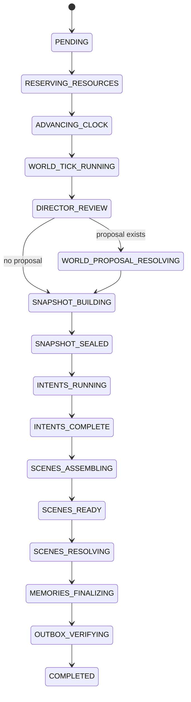

# Simulation Engine: Time, Phases, Scenes, and Resolution Flow

**Version:** 1.0  
**Status:** Normative simulation behaviour  
**Primary owner:** `worldsim.application.simulation` plus deterministic rules in `worldsim.domain`

---

## 1. Purpose

This document specifies how fictional time advances, when models are called, how simultaneous intents become scenes, how reactions are bounded, how scenes commit, how quiet time is compressed, and how the world ends.

The simulation engine is the spine of the project. Agent graphs are invoked by it; they do not own the global loop.

---

## 2. Detailed calendar

The canonical ordered detailed phases are:

```python
PHASES = (
    "dawn",
    "sunrise",
    "morning",
    "noon",
    "afternoon",
    "sunset",
    "dusk",
    "evening",
    "night",
    "midnight",
)
```

The phase names are narrative intervals, not fixed Earth-hour durations. A world configuration may attach approximate local time and expected duration, but ordering is strict.

Each detailed transition increments `absolute_phase_index` by one. Moving from midnight to dawn increments `absolute_day_index` and calendar day.

The initial world uses one global clock. Distant regions still share the same ordered phase, though local presentation may include region-specific light/weather. Pocket dimensions or altered-time zones are deferred until a dedicated rule system exists.

---

## 3. Phase state machine

Canonical operational states:

```text
PENDING
RESERVING_RESOURCES
ADVANCING_CLOCK
WORLD_TICK_RUNNING
DIRECTOR_REVIEW
WORLD_PROPOSAL_RESOLVING
SNAPSHOT_BUILDING
SNAPSHOT_SEALED
INTENTS_RUNNING
INTENTS_COMPLETE
SCENES_ASSEMBLING
SCENES_READY
SCENES_RESOLVING
MEMORIES_FINALIZING
OUTBOX_VERIFYING
COMPLETED
PAUSE_REQUESTED
PAUSED
FAILED_RETRYABLE
FAILED_PERMANENT
```

Terminal states are `COMPLETED` and `FAILED_PERMANENT`. `PAUSED` is resumable.

### Normal transition



Any non-transactional active state may enter `FAILED_RETRYABLE` and resume through an idempotent task. Permanent validation failure either uses a defined fallback or makes the phase `FAILED_PERMANENT` before partial canon is exposed.

---

## 4. Phase resource reservation

Before advancing the clock, the orchestrator estimates the minimum remote calls needed to finish safely.

For Stage 1 with two eligible characters:

```text
Required minimum:
  2 character-action calls
  0 director calls unless trigger already decided
  0 resolver calls for deterministic simple scenes
  1 resolver call only if an ambiguous interaction is expected and budget permits

Optional:
  narration
  embedding
  evaluator
```

A phase may start when either:

1. required provider quota is conservatively available; or
2. every required role has a deterministic/fake/local fallback that preserves phase completion.

The system must not consume one character’s remote action and then discover that the second cannot be produced with no valid fallback.

Reservations expire and are reconciled with actual calls. They are local conservative controls; provider-reported limits remain external truth.

---

## 5. Clock advancement and World Engine tick

The World Engine always executes first.

### 5.1 Clock effect

The next calendar position is computed but committed together with deterministic phase-start effects. A crash cannot leave the clock advanced without the associated tick event.

### 5.2 Tick order

Use a stable order:

1. advance calendar position;
2. activate due scheduled effects;
3. progress weather/seasonal systems;
4. progress travel and ongoing activities;
5. evaluate activity interruption candidates;
6. update stamina, mana, needs, and ordinary recovery;
7. progress injuries and conditions;
8. update age-dependent state when a day boundary requires it;
9. advance faction/background systems according to their resolution tier;
10. generate deterministic encounter candidates from stored seed and route/world risk;
11. evaluate death, peace, eradication, and maximum-day conditions;
12. commit one or more typed World Engine events;
13. produce the post-tick committed state from which Director review begins.

### 5.3 Deterministic randomness

Random decisions use a centrally derived seed:

```text
seed = H(world_seed, absolute_phase_index, subsystem_key, subject_id, attempt_generation)
```

Store the seed or derivation inputs with events. Exact model replay is not required, but deterministic rules should reproduce from identical state and seed.

Do not use process-global random state.

---

## 6. Narrative Director review

The Director is reviewed after the deterministic tick and before the character snapshot.

### 6.1 Deterministic trigger calculation

Code first calculates a `DirectorTriggerAssessment` from:

- due arc/hook schedule;
- phases since meaningful decision;
- recent event intensity trend;
- unresolved consequences;
- repeated locations/actions/participant groups;
- relationship stagnation;
- goal stagnation;
- faction-plan milestones;
- user Director command;
- random opportunity budget;
- major-event cooldown.

The assessment yields:

```text
NO_CALL
CALL_MINOR_OPPORTUNITY
CALL_ARC_ADVANCEMENT
CALL_SCHEDULED_EVENT
CALL_USER_DIRECTED
```

The model does not decide whether it deserves to be called every phase.

### 6.2 Director proposal rules

A proposal states:

- event category and narrative purpose;
- affected or candidate entities;
- location and timing;
- prerequisites;
- public/private visibility plan;
- desired tension/genre effect;
- maximum permitted effect types;
- whether the event is fixed, predicted, or conditional;
- duration and escalation limits;
- fallback if rejected.

The Director cannot directly set success, damage, relationship values, or knowledge disclosure.

### 6.3 Proposal resolution

Deterministic validation checks lore, map, schedule, entity availability, director privileges, cooldowns, and forbidden content. A semantic validator may reject implausible proposals. Accepted world proposals are resolved and committed before snapshot sealing, so all characters’ same-phase perceptions reflect them consistently.

---

## 7. Phase snapshot

The snapshot is a version manifest over committed state, not a full duplicate of the database.

It records:

- world event sequence;
- clock version;
- relevant entity and aggregate versions;
- world-rule/config versions;
- active arc/hook versions;
- participant eligibility decisions;
- context source hashes.

Once sealed:

- it cannot be edited;
- all primary action proposals reference it;
- character contexts may differ by perspective but not by canonical version;
- later commits must detect if affected aggregates changed unexpectedly.

No unrelated same-phase scene outcome is inserted into another character’s primary intent context.

---

## 8. Character activation and inference eligibility

A persistent focus character receives no full action call only when a deterministic state already defines the phase behaviour.

### 8.1 Skip reasons

Examples:

- unconscious with no possible reaction;
- asleep and no interruption candidate;
- dead;
- continuing a non-decision travel/activity segment;
- magically suspended;
- absent during macro simulation;
- temporarily quarantined after repeated model failure, with safe activity continuation.

A skip creates an explicit deterministic action record such as `CONTINUE_ACTIVITY`, `SLEEP`, or `NO_CAPABLE_ACTION`. It is not an invisible omission.

### 8.2 Eligible characters

All other focus characters receive one primary decision request. They may return:

- a meaningful action;
- `WAIT`;
- `REST`;
- `OBSERVE`;
- `CONTINUE_ACTIVITY`.

With only four focus characters, do not use a separate model to suppress legitimate decisions merely to save requests.

### 8.3 Temporary NPCs

NPC action resolution depends on scene relevance:

- background extras: deterministic/aggregate;
- temporary named NPCs: one batched NPC actor call if meaningful;
- recurring supporting NPCs: bounded call from perspective-safe NPC context;
- off-screen NPCs: lower-resolution Director/background update.

---

## 9. Primary intent generation

All eligible focus requests may execute concurrently.

Each receives:

- same snapshot ID;
- its own perception package;
- own state, relationships, goals, plans, memory, known map/lore, and available tools;
- output schema and action budget.

Each returns exactly one primary proposal. Ranked alternatives are not used initially because they consume output and complicate selection; a single typed fallback is included instead.

The action’s free-form intent can be novel, but desired effects are non-authoritative and constrained to allowed categories.

---

## 10. Scene assembly

### 10.1 Candidate grouping keys

Group proposals using:

1. explicit target entity;
2. explicit target location;
3. same current location and overlapping activity window;
4. shared scheduled event;
5. same unique item/resource;
6. intersecting route segment;
7. appointment, promise, or plan link;
8. mutual social intent;
9. director-proposed encounter;
10. deterministic chance encounter.

### 10.2 Merge examples

```text
A visits B + B waits for A
  → one social scene

A attacks B + B leaves location
  → one conflict scene

A picks up sword + B sells sword
  → one resource-conflict scene

A studies alone in library + B trains at barracks
  → independent scenes
```

### 10.3 Mutable aggregate set

For every scene, compute entities and global aggregates that could change:

- participants;
- target entities;
- current/target locations;
- unique items;
- activities;
- faction/global resources;
- scheduled effect records.

Scenes with intersecting mutable sets are merged or serialized. Read-only overlap does not automatically prevent parallel resolution.

### 10.4 Scene types

Initial stable types:

```text
SOLO_ACTION
SOCIAL_INTERACTION
DIALOGUE
NEGOTIATION
TRAVEL
INVESTIGATION
RESOURCE_CONFLICT
COMBAT
MAGIC_RITUAL
WORK_OR_TRAINING
WORLD_EVENT_RESPONSE
BACKGROUND
```

---

## 11. Scene priority

Priority determines resolution order, not hidden reality or primary-intent knowledge.

Recommended score:

```text
priority =
    0.25 * causal_urgency
  + 0.20 * immediate_danger
  + 0.15 * scheduled_commitment
  + 0.15 * unresolved_dependency
  + 0.10 * goal_relevance
  + 0.10 * starvation_fairness
  + 0.05 * narrative_salience
```

All values are normalized `0..1`.

Deterministic inputs own 95% of the score. A small model may supply only `narrative_salience` after receiving non-secret scene summaries.

`starvation_fairness` increases when a focus character has received little meaningful spotlight over recent phases/days.

Priority does not decide intra-scene initiative.

---

## 12. Attempts, reactions, and beat budgets

### 12.1 Ownership

An actor owns:

- its intention;
- its chosen attempt;
- its utterance;
- observable body movement;
- expectations framed as uncertainty.

An actor does not own:

- another participant’s hidden thought;
- another participant’s preparation unless previously observable/canonical;
- another participant’s successful dodge, refusal, affection, fear, or injury;
- final outcome.

### 12.2 Reaction eligibility

A participant may react when:

- present or validly connected;
- capable of perceiving the attempt in time;
- conscious and not fully constrained;
- the action allows a reaction window;
- beat budget remains.

Preparation already stored in state may improve reaction feasibility. A reaction cannot retroactively invent preparation merely because it is useful.

### 12.3 Default beat budgets

| Scene | Budget |
|---|---:|
| Two-person dialogue | 4 beats: two per participant |
| Group dialogue | 6 total beats |
| Negotiation | One proposal and one response per participant, plus one closing beat |
| Combat | 3 attack/reaction exchanges before continuation |
| Solo action | 1 attempt plus resolver |
| Background NPC scene | 1 compact batch response |
| Ritual/investigation | 2–4 beats based on configured complexity |

A beat may contain one short utterance and one meaningful action. Long prose does not create more mechanical actions.

When the budget ends:

- commit the current outcome;
- create/advance an ongoing scene activity if unresolved;
- continue next phase if participants remain engaged.

A model output-token limit is an additional bound, not a substitute for beat budgets.

---

## 13. Initiative

Intra-scene initiative uses:

- prior preparation;
- surprise;
- perception;
- dexterity;
- relevant skill;
- stamina;
- injuries/conditions;
- action urgency;
- terrain and position;
- deterministic seeded uncertainty.

Initiative is calculated by rules. A resolver may interpret ties or complex multi-actor positioning but may not ignore the feasible order.

Social scenes may use conversational ownership rather than combat initiative: the actor who initiated the scene gets the opening beat unless another canonical event interrupts.

---

## 14. Resolution selection

### 14.1 Deterministic resolver

Use without an LLM when rules fully determine the result:

- wait/rest/observe;
- ordinary movement with valid route and no encounter;
- activity continuation;
- uncontested item transfer with consent;
- resource recovery/cost;
- routine skill practice evidence;
- deterministic condition progression.

### 14.2 Hybrid model-assisted resolver

Use when valid outcomes remain ambiguous:

- social persuasion or deception;
- partial success shape;
- emotionally plausible reaction consequences;
- complex combat tactics within a feasible envelope;
- creative complication selection;
- ambiguous magical improvisation;
- non-trivial investigation interpretation.

The model receives:

- validated attempts/reactions;
- allowed effect union for the scene;
- feasible ranges and forbidden outcomes;
- current relevant state;
- deterministic random/roll results where applicable;
- no authority to introduce unrelated entities/effects.

### 14.3 Dynamic effect schema

Send only effects allowed by scene type.

Example:

```text
Dialogue:
  CREATE_CLAIM
  RELATIONSHIP_EVIDENCE
  UPDATE_PLAN
  SCHEDULE_EFFECT

Travel:
  MOVE_ENTITY
  SPEND_RESOURCE
  ADVANCE_ACTIVITY
  APPLY_CONDITION only when route event permits

Combat:
  SPEND_RESOURCE
  APPLY_INJURY
  APPLY_CONDITION
  TRANSFER_ITEM when disarm/theft is feasible
  SKILL_PROGRESS_EVIDENCE
  MARK_DEATH only in explicit high-impact mode
```

This is both reliability and privilege control.

---

## 15. Invalid action ladder

For malformed or impossible character output:

1. reject schema-invalid response;
2. attempt deterministic JSON extraction/repair only;
3. validate Pydantic contract;
4. return concise validation errors for one regeneration;
5. validate regenerated proposal;
6. use the proposal’s typed fallback if valid;
7. use deterministic `CONTINUE_ACTIVITY`, `WAIT`, or `OBSERVE`;
8. record model-quality failure.

Do not loop until the model complies.

For a semantically invalid but physically attempted action, the system may resolve it as a failed attempt instead of silently replacing it. Example: trying to cast an unknown spell can become an unsuccessful magical experiment if the character plausibly chooses it.

---

## 16. Commit and narration

Resolution produces:

- accepted attempts;
- rejected assumptions;
- typed immediate effects;
- delayed/scheduled effects;
- observer fact envelopes;
- narration constraints;
- visual significance.

The transaction service commits facts and projections. Only then may presentation narration be generated.

Narration inputs include:

- accepted attempts and reactions;
- committed structured outcome;
- participant voice/style data;
- perspective-specific allowed facts;
- scene tone and length;
- explicit prohibition against changing outcomes.

Possible presentations from one event:

- omniscient visual-novel scene;
- character-perspective scene;
- one-line timeline summary;
- diary retrospective;
- encyclopedia update.

These are derived outputs.

---

## 17. Memory finalization and phase completion

Before phase completion:

1. every committed event has required observations;
2. every participating focus character has a recent-memory decision, even if “not salient enough” is recorded;
3. claims/belief evidence and relationship evidence are written;
4. ongoing activities/plans are updated;
5. all required image/embedding/projection work is in outbox/task state;
6. expected and completed scene counts match;
7. no scene remains in a non-terminal state;
8. phase state becomes `COMPLETED` once.

Daily compaction can occur after midnight as a day-boundary workflow. The next dawn may wait for mandatory daily summaries in Stage 2+ but need not wait for optional long-term embedding if recent relational memory remains available.

---

## 18. Pause and resume

### Safe pause boundaries

- before starting a phase;
- after a World Engine event commit;
- after director proposal resolution;
- after snapshot sealing but before dispatching intents;
- after all intents complete;
- between independent scene commits;
- after phase completion.

A user pause requested during a remote call or database commit becomes `PAUSE_REQUESTED` and is honored at the next safe boundary.

Resume reads durable phase/task state and continues idempotently. It does not restart the whole day unless an explicit repair command requests that behaviour.

---

## 19. Failure recovery

| Failure point | Recovery |
|---|---|
| Before clock commit | Retry phase start with same idempotency key. |
| After World Engine commit | Detect event and continue Director review. |
| One character call fails | Retry bounded; then safe fallback for that actor. Other completed intents remain stored. |
| Scene assembly crash | Rebuild deterministically from stored proposals. |
| Resolver call fails | Retry or deterministic safe outcome; scene remains uncommitted. |
| Commit races/stale version | Re-read, reassemble affected scene if needed, and regenerate resolution only when assumptions changed. |
| Observation phrasing fails | Commit allowed fact envelope; use template phrasing and enqueue repair. |
| Image enqueue worker fails | Outbox remains pending; phase may still complete if outbox row exists. |
| Daily compaction fails | Retry before configured next-day gate; raw observations remain safe. |

---

## 20. Detailed versus macro simulation

### 20.1 Why compression is mandatory

Three generations at ten phases per day cannot be simulated with full focus-character LLM calls for every phase. Macro simulation is a product requirement, not a performance optimization.

### 20.2 Resolution levels

```text
DETAILED_PHASE
DAY_SUMMARY
WEEK_SUMMARY
MONTH_SUMMARY
YEAR_SUMMARY
```

### 20.3 Compression eligibility

A period may be compressed when:

- no active high-intensity scene;
- no scheduled high-salience event within the interval;
- no critical injury or birth/death window requiring detail;
- no user lock to detailed mode;
- active arcs allow background progression;
- characters’ plans are stable enough for summarized execution.

### 20.4 Macro simulation algorithm

1. Choose proposed interval and store deterministic seed.
2. Gather persistent activities, goals, relationships, injuries, faction plans, schedules, and demographic changes.
3. Run deterministic updates at appropriate granularity.
4. Generate bounded life-event proposals for focus/lineage characters and important recurring NPCs.
5. Validate and resolve typed aggregate effects.
6. Stop early if a high-salience event or conflict is produced.
7. Commit macro events and structured summaries.
8. Materialize public and perspective-specific knowledge.
9. Return to detailed mode at the event boundary.

Macro simulation cannot directly make a character “suddenly married” or “legendary” without sourced events/evidence, even if those events are compactly represented.

---

## 21. End conditions

### 21.1 World peace

Peace is not “no combat this day.” Recommended configurable criteria:

- no active existential or major inter-faction war;
- major arc conflicts resolved;
- faction hostility below threshold;
- no imminent high-probability catastrophic hook;
- basic settlement viability and governance;
- sustained for a configured number of days/months;
- at least one accepted stable political/social arrangement.

A final Director/evaluator review may summarize peace, but deterministic metrics decide eligibility.

### 21.2 World eradication

Eradication requires one of:

- all viable civilization entities destroyed;
- no living focus/lineage continuation and no configured recovery path;
- environment permanently non-viable under current lore;
- explicit catastrophic world-state terminal effect.

A single protagonist death is not world eradication.

### 21.3 Maximum days/generations

The world ends when configured maximum days or three generations are reached. The final workflow creates:

- canonical ending event;
- final world summary;
- character/lineage outcomes;
- unresolved-hook ledger;
- final encyclopedia and map state;
- image/asset completion queue;
- immutable end-state marker.

---

## 22. Simulation tests

Minimum deterministic tests:

- phase order and day rollover;
- world tick before snapshot;
- same snapshot for all primary intents;
- deterministic skip records;
- scene grouping examples;
- conflict-set detection;
- priority score calculation;
- beat-budget enforcement;
- preparation cannot be invented by reaction;
- invalid-action fallback;
- independent scene parallel eligibility;
- pause at each safe boundary;
- crash/restart at every state transition;
- macro compression eligibility and high-salience early stop;
- peace/eradication/maximum-day evaluation.
