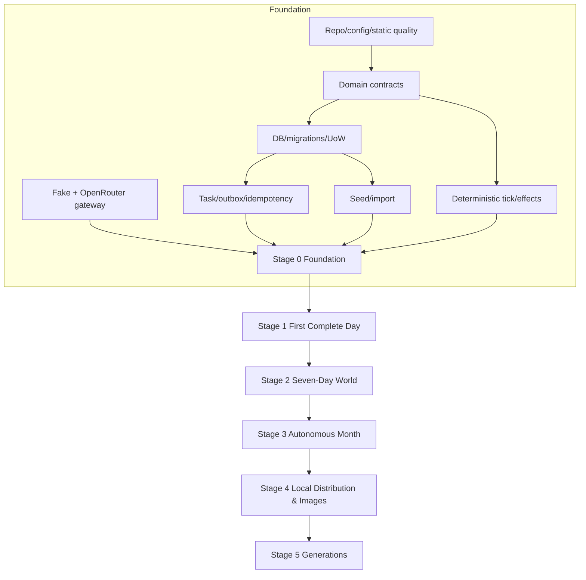

# Master Implementation Plan

**Version:** 1.0  
**Status:** Normative stage and workstream plan  
**Primary owners:** parent coding agent, project owner, stage reviewers  
**Required reading:** `00`–`07`, `19`–`23`, `31`, `32`

---

## 1. Purpose

This document converts the architecture into an ordered implementation program. It defines stages, dependency gates, workstreams, safe parallelism, integration order, expected artefacts, and how a coding agent should proceed across multiple sessions and subagents.

Stage details live in `25`–`30`. The backlog and traceability source lives in `32`.

---

## 2. Delivery principle

Build one narrow, durable vertical slice at a time:

```text
contracts
  → persistence
  → deterministic execution
  → one bounded model role
  → canonical commit
  → perspective memory
  → API/UI observation
  → restart/fault proof
  → scale breadth
```

Do not implement all prompts, all rules, all UI pages, distributed inference, and images simultaneously.

---

## 3. Stage map

| Stage | Outcome | Main proof |
|---|---|---|
| 0 | Foundation | Seed, deterministic event/task engine, migrations, fake/provider adapters, restart-safe primitives |
| 1 | First complete day | Two characters, three enabled phases, simultaneous intents, bounded scene/reaction/resolution, recent memories, minimal live UI |
| 2 | Coherent seven-day world | Four focus characters, all ten phases, triggered Director, temporary NPC, travel, claims/beliefs, daily summaries/diaries |
| 3 | Autonomous month | Long-term RAG, arcs/factions, injuries/magic/combat, monthly reflection, quality controls, 30-day soak |
| 4 | Distributed local system and images | Two Halo text replicas, durable distributed orchestration, ComfyUI, object assets, failover and visual continuity |
| 5 | Three generations | Adaptive time compression, ageing/genealogy/succession, macro world evolution, endings and final export |

No stage is complete until its hard gate passes.

---

## 4. Workstreams

```text
ARCH  Architecture, ADRs, contracts, traceability
ENG   Repository, configuration, code quality, generated artefacts
DB    PostgreSQL, migrations, repositories, event log, projections
SIM   Clock, phase/scene engine, rules, resolver integration
CHAR  Character cards, psychology, relationships, goals/plans
KNOW  Perception, claims, beliefs, memory, RAG
MODEL Model gateway, OpenRouter/local adapters, prompts, evaluation
GRAPH LangGraph bounded workflows
ORCH  Tasks, leases, idempotency, outbox, Temporal later
API   FastAPI commands/queries/WebSocket
UI    Vue client and user modes
WORLD Director, lore, map, NPCs, factions, arcs
RULES Stats, magic, injuries, combat, progression
IMG   ComfyUI, visual state, object storage, gallery
OPS   Observability, security, runbooks, deployment
QA    Tests, scenarios, faults, soak, stage evidence
CONTENT Seed and authoring
MACRO Time compression, genealogy, succession, endings
```

Workstreams are ownership labels, not permanent teams. One agent may own several small workstreams; parallel subagents should receive nonoverlapping task packets.

---

## 5. Dependency graph



Within each stage, task dependency tables are authoritative.

---

## 6. Cross-stage architectural runway

Implement only the interfaces required for later substitution:

- provider-neutral model gateway in Stage 0 so Stage 4 can add local adapters;
- `WorldOrchestrator` interface in Stage 0 so Stage 4 can add Temporal;
- capability queues in task records before multiple machines;
- visual profile references in domain only when Stage 4 needs them;
- versioned embeddings in Stage 3 so model migration is safe;
- event/provenance from Stage 0 so generations can summarize history;
- explicit world/branch IDs even though there is one active world.

Do not build future runtime complexity before it is needed.

---

## 7. Stage promotion protocol

For each stage:

1. parent agent freezes scope and reads stage document;
2. create/update `docs/status/CURRENT_STAGE.md`;
3. split tasks into bounded packets using `35`;
4. assign nonoverlapping files to subagents;
5. merge in dependency order;
6. run subsystem tests after each merge;
7. run current and previous stage scenarios;
8. run fault and leakage gates required for the stage;
9. generate evidence bundle;
10. conduct architecture/domain/security review;
11. resolve or explicitly record non-hard issues;
12. mark stage complete and create next-stage baseline tag/commit.

Hard gate failures cannot be waived merely because a demo looks good.

---

## 8. Recommended branch/tag strategy

```text
main
  always passes latest completed stage gate.

stage/<n>-integration
  optional integration branch while stage work is active.

task/<task-id>-<slug>
  one bounded task/subagent.

stage-0-complete
stage-1-complete
...
```

A parent agent may merge task branches locally without remote PRs during private development, but must preserve task IDs, test evidence, and coherent commits.

---

## 9. Parallelization rules

### 9.1 Safe early parallelism

After contracts/interfaces are frozen:

- database migrations and model fake adapter;
- seed authoring and repository static tooling;
- API read DTOs and deterministic domain unit tests;
- frontend shell and generated-client setup after OpenAPI stub;
- prompt corpus and fake model fixtures;
- observability scaffolding and core domain logic.

### 9.2 Unsafe parallelism

Do not independently implement:

- domain Pydantic contract and database schema for the same object without one agreed schema;
- phase state machine and orchestrator status model;
- effect command union and resolver prompt/schema;
- API DTO and frontend local duplicate types;
- memory access policy and retrieval SQL;
- model gateway retry logic in several graph nodes;
- migrations touching the same tables;
- seed keys and runtime entity IDs.

### 9.3 Integration owner

Every stage has one parent/integration agent responsible for:

- contract decisions;
- dependency merge order;
- resolving cross-task changes;
- running stage scenario;
- updating docs/traceability;
- rejecting unscoped “helpful” changes.

---

## 10. Session cadence

Each coding session:

1. read `AGENTS.md`, current stage, current status, task packet;
2. inspect repository state and tests;
3. restate task boundaries in session log;
4. implement smallest testable increment;
5. run targeted tests frequently;
6. run required integration checks before stopping;
7. update task/checklist and handoff using `34`;
8. commit only coherent state or explicitly record uncommitted files.

Never leave the next agent to infer database migration status, active failures, or unrun tests.

---

## 11. Definition of a vertical slice

A feature is not complete when only a model can output it. A vertical slice includes, as applicable:

```text
contract/schema
validation
persistence/migration
application command/query
orchestration/task state
provider/graph integration
canonical commit or derived artefact
API projection
minimal UI/diagnostic visibility
tests and failure paths
documentation/provenance
```

Stage documents may intentionally omit UI for low-level foundations, but the omission is explicit.

---

## 12. Model-use progression

```text
Stage 0
  fake model is authoritative for tests; live OpenRouter capability smoke only.

Stage 1
  live text model can generate two character intents/reactions;
  fake model remains acceptance source.

Stage 2
  Director/NPC/summarizer roles; carefully budgeted live sampling.

Stage 3
  embeddings and RAG; 30-day volume mainly fake/local scripted,
  with sampled live quality runs.

Stage 4
  route roles to local models one at a time; OpenRouter can remain fallback.

Stage 5
  macro role and long-horizon evaluation.
```

Do not consume free quota to execute deterministic CI or large soak runs.

---

## 13. Data migration progression

```text
Stage 0
  core world/entity/character/phase/task/event/observation/recent-memory tables.

Stage 1
  actions/scenes/reactions/resolutions/command and WebSocket projection support.

Stage 2
  goals/plans/relationships/claims/beliefs/NPC/travel/daily summaries.

Stage 3
  memory embeddings/arcs/factions/rules/magic/injuries/conditions/monthly data.

Stage 4
  images/assets/workflow/worker/Temporal metadata.

Stage 5
  genealogy/age curves/macro runs/generation transitions/endings/exports.
```

Every stage migration must upgrade a previous-stage fixture.

---

## 14. UI progression

```text
Stage 0
  no production UI required; CLI/diagnostic endpoints.

Stage 1
  world runtime, timeline, character overview, player action input, live status.

Stage 2
  full timeline, map basics, diary, relationships, Director control.

Stage 3
  encyclopedia, arcs/factions, memory inspector, quality and month controls.

Stage 4
  visual-novel view, gallery, worker/image operations.

Stage 5
  genealogy, generation/era timeline, macro-time controls, ending archive.
```

---

## 15. Risk-first order

The highest-risk concepts must be proved early:

1. canonical event/effect transaction and idempotency;
2. simultaneous snapshot/scene semantics;
3. knowledge isolation;
4. bounded model output repair/fallback;
5. memory compaction without fact leakage;
6. long-running consistency and growth;
7. worker failure/distribution;
8. visual identity;
9. multi-generation compression.

Do not spend early weeks polishing map animation before these risks have tests.

---

## 16. Expected milestone artefacts

Every stage produces:

- code and migrations;
- active configuration profile;
- generated schemas/OpenAPI as applicable;
- seed/fixture version;
- deterministic scenario scripts;
- stage gate report;
- known-issues list;
- session log/handoffs;
- version manifest;
- updated traceability matrix;
- backup/export of the completed-stage test world when useful.

---

## 17. Completion horizon

The architecture supports the complete vision, but the first meaningful product milestone is Stage 3: one autonomous coherent month. Stage 4 and Stage 5 should not be allowed to conceal unresolved Stage 3 memory or consistency defects.

The coding agent should optimize for correctness and inspectability first, then quality and scale, then distribution and visual richness, then generations.
